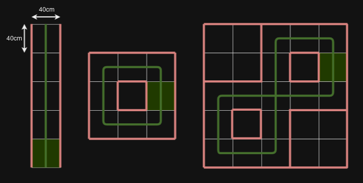

# Lab 8 - Midterm Test (Line Following)

Up to 50 points can be earned through two practical demonstrations of task solutions during the semester.

8th week - Line Following (25 points)

12th week - Corridor Following (25 points)

## Line Following Rules

There are 3 tracks:
 - Straight Line (5 points)
 - Simple Loop (10 points)
 - Complex Loop (10 points)

All tracks are in rectangular grid of 40x40cm

Full points are awarded only for completing the entire track.

Teams have 3 attempts per track, with a time limit of 3 minutes per attempt.

All 3 attempts have to be performed during a single lab.

## Test Tracks

