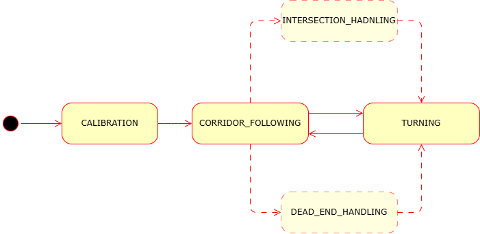

# Lab 10 – Orientation-Aware Corridor Navigation

**Responsible:** Ing. Petr Šopák

### Learning Objectives

**1) Understanding robot orientation using IMU (MPU6050)**
  - Interpreting raw gyroscope data
  - Calibrating and integrating gyro values to estimate yaw

**2) Extending corridor following with corner handling**
  - Detecting turns (e.g. 90° corners) using range sensors
  - Executing rotation using IMU feedback

**3) Implementing a state-based navigation strategy**
  - Designing a simple state machine
  - Switching between corridor following and turning behavior

## Introduction

In **Lab 9**, you implemented a basic reactive controller that allowed the robot to follow straight corridors using range sensors such as LiDAR or ultrasonic. However, that approach assumed a straight path and could not handle corners or sharper turns.

In this lab, you will extend that behavior by enabling your robot to detect and turn into new corridor directions (e.g., 90° left or right turns). To accomplish this, you will use an **Inertial Measurement Unit (IMU)** — specifically the **MPU6050** ([LINK](https://www.alldatasheet.com/datasheet-pdf/pdf/1132807/TDK/MPU-6050.html#:~:text=Part%20#:%20MPU-6050.%20Download.%20File%20Size:%20905Kbytes.%20Page:,MotionTracking%20Device%20with%20DMP%20(MPU-6050/-6000).%20Manufacturer:%20TDK%20Electronics.)) — to estimate the robot's yaw (rotation around the vertical axis).

The robot will:
- Follow the corridor as before
- Detect the corner
- Rotate in place until it is aligned with the new corridor direction
- Resume forward motion

To implement this, you will also develop a simple **finite state machine** with at least two states: *CORRIDOR_FOLLOWING* and *TURNING*.


## IMU and Orientation Estimation

The MPU6050 sensor provides raw data from a gyroscope and accelerometer. Unlike more advanced IMUs, it does not provide direct orientation estimates such as yaw, pitch, or roll.

To estimate yaw (rotation angle), you will:
1. **Read the raw gyroscope value for the z-axis** (`gyro_z`), which represents angular velocity around the vertical axis.
2. **Calibrate**:
   - Keep the robot still for 2–5 seconds after startup.
   - Collect multiple `gyro_z` values.
   - Compute the average value as the `gyro_offset`.
3. **Integrate over time**:
   - Subtract the offset from each reading.
   - Multiply by the time delta (`dt`) to obtain the yaw angle increment.
   - Accumulate this over time to estimate the current yaw:

```cpp
yaw += (gyro_z - offset) * dt;
```

### Practical Integration Tip
In this lab, you are required to implement the yaw integration yourself. No sensor fusion libraries will be used. Keep in mind that this method is sensitive to drift, so proper calibration is critical.

### Corner Detection

When following a corridor, the robot can monitor the side range sensors. If a wall suddenly "disappears" on one side (i.e., the distance becomes much larger), and the front is also open, it likely means the corridor turns in that direction.

An alternative strategy is to detect a wall in front of the robot (i.e., front distance drops below a defined threshold), and then search for an opening on the sides to determine where the corridor continues. However, this method is problematic in case of intersections, as the robot may overshoot the corner and fail to turn properly. 

----------------------------------------------------------------------------------------------
**TASK 1 – IMU Integration and Yaw Estimation**

1. Create a new ROS 2 node for the IMU (e.g., imu_node)
2. **Subscribe to the MPU6050 data** and read `gyro_z` values from the topic
3. **Implement calibration**:
   - At the beginning of the program, keep the robot completely still for 2–5 seconds
   - During this time, collect several `gyro_z` values.
   - Compute the average of these samples to obtain the gyroscope offset `gyro_offset`.
   > You will subtract this offset from all future gyro readings to reduce drift
4. **Estimate yaw (heading)**:
   - In a timed loop, Subtract the `gyro_offset` from the current `gyro_z` value to get the **corrected angular velocity**
   - Multiply the corrected value by the time delta `dt` to get the yaw increment
   - Accumulate this increment into a variable yaw that represents the current robot orientation (the formula was described before)
5. **Test IMU-based yaw estimation and implement basic heading correction**
   1) **Manual Rotation test**
      - Calibrate the IMU and after store the current yaw
      - Pick up or gently rotate the robot by approximately 90° (by hand)
      - The robot should detect the yaw error:
        ```c++
        float yaw_error = yaw_ref - current_yaw;
        ```
      - If the error exceeds a threshold (e.g. 5°), apply a corrective rotation using differential motor speeds:
        ```c++
        float correction = Kp * yaw_error;
        motor_node->set_motor_speed(127 - correction, 127 + correction);
        ```
      - **The robot should rotate back toward its original orientation**
    3) **External Disturbance test**
       - While the robot is driving straight or standing still, apply a light push to rotate it
       - The robot should detect the change in yaw and try to rotate back to its original heading based on the integrated yaw 
       > **Never forget the calibration** — without it, even small disturbances will cause large drift!

## State Machine for Corridor Navigation

If you have implemented the IMU, you are now ready to **extend your corridor-following behavior**. In this lab, you will implement a simple **state machine** to structure the robot's behavior during navigation. Instead of relying on a single control strategy, your robot will dynamically switch between multiple modes:
  - **CALIBRATION** – the robot stays still and computes IMU offset before navigation begins
  - **CORRIDOR_FOLLOWING** – the robot drives straight and uses side range sensors to stay centered between walls
  - **TURNING** – the robot rotates in place using the IMU until a 90° turn is completed
  - *(Later additions:)* **INTERSECTION_HANDLING**, **DEAD_END_HANDLING**, etc.

This modular architecture will make your logic easier to extend in future — for example, adding states **INTERSECTION_HANDLING** (dvě či tři cesty), **DEAD_END_HANDLING** (slepá ulička) and more...

<p id="state_machine" align="center">
  
</p>
<p align="center">
    <em> Figure 1: Example state diagram for corridor-following behavior </em>
</p>

> **Notes:**
> - The structure below is just an example. You are free to design your own solution — **don’t feel limited by this template!**
> - Keep your implementation modular so it can be extended in future
> - Always calibrate the IMU at startup to avoid drift in yaw estimation

----------------------------------------------------------------------------------------------
**TASK 2 - Implementing Corner Detection and Turning**
1. In your **corridor loop node**, integrate the **state machine logic**
   - Example Structure:
     ```c++
      switch (state) {
       case CALIBRATION:
      // Wait until enough samples are collected
      // Once done, switch to CORRIDOR_FOLLOWING
      break;
     
        case CORRIDOR_FOLLOWING:
          // Keep centered using P/PID based on side distances
          // If front is blocked and one side is open → switch to TURNING
          break;
      
        case TURNING:
          // Use IMU to track rotation
          // Rotate until yaw changes by ±90°
          // Then return to CORRIDOR_FOLLOWING
          break;
      }
      ```
2. In the `CORRIDOR_FOLLOWING` state:
    - Use side range sensor data to stay centered between walls.
    - **Monitor the front sensor**: if the front distance falls below a threshold (e.g., < 10 cm) and one side is open, detect a corner
    - Based on which side is open, decide the direction to turn (left or right)
    - Switch to the `TURNING` state
3. In the `TURNING` state:
    - Store the current yaw as `yaw_start`
    - Command the robot to rotate
    - Continuously read yaw and compare with `yaw_start`
    - When the yaw change reaches ~90°, stop the rotation and switch back to `CORRIDOR_FOLLOWING`