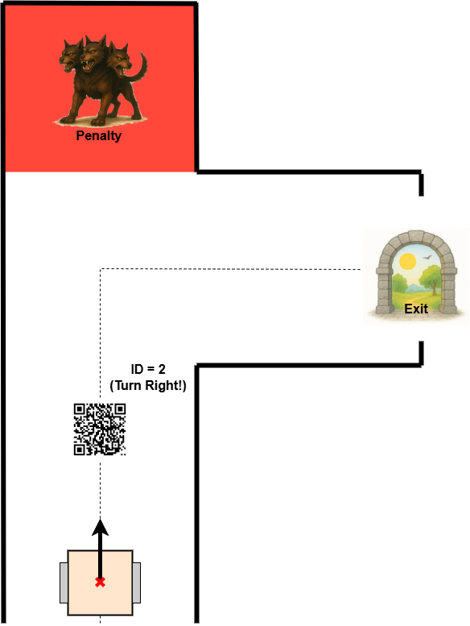

# Lab 11 - Visual Navigation Using ArUco Markers

Responsible: Ing. Petr Šopák

### Learning Objectives

**1) Camera-based detection of visual markers**
  - Subscribing to a camera image topic
  - Converting ROS image messages to OpenCV format
  - Detecting ArUco markers using a provided detector

**2) Using markers for high-level decision making**
  - Associating marker IDs with semantic instructions (e.g., “turn left”, “goal”)
  - Storing and reusing symbolic information
  - Implementing logic that uses past observations during navigation

## Requirement

For this lab, you need to have the `image transport compressed package` installed:
```shell
sudo apt update
sudo apt install ros-humble-image-transport-plugins -y
```
To check all available transport plugins, run:

```shell
ros2 run image_transport list
```

You should see an output similar to:

```shell
Declared transports:
image_transport/compressed
image_transport/compressedDepth
image_transport/raw
image_transport/theora

Details:
...
```

## Introduction

In previous labs, you explored sensor-based navigation using range sensors and IMUs. These approaches allowed the robot to react to its surroundings, but they did not provide access to symbolic information or long-term guidance.

In this lab, your robot will **navigate through a maze where ArUco markers act as visual hints**. These markers are placed at strategic locations and convey semantic instructions, such as which direction to take at an intersection, or where a shortcut to a goal (e.g., treasure) can be found.

The robot’s goal is to **detect the markers, interpret their meaning, and use this information later** when making decisions in the maze. This symbolic memory allows the robot to act in a more informed and efficient way, rather than relying solely on reactive behaviors.

## Camera and Marker Detection (Approx. 50 minutes)

In the first part of the lab, you will implement a ROS 2 node (`CameraNode`) that subscribes to a camera image stream, converts the received image into OpenCV format, and detects ArUco markers.

You are provided with a partial implementation of the `ArucoDetector` class. Your task is to complete this class and integrate it into your ROS node.
----------------------------------------------------------------------------------------------
**TASK 1 – Camera Subscription and Marker Detection**

1. Create a new ROS 2 node - `camera_node`
    - Subscribe to a camera image topic (`/bpc_prp_robot/camera/compressed`) using `sensor_msgs/msg/compressed_image.hpp`
    - In the callback, decode the incoming compressed image message using `cv::imdecode` to obtain a `cv::Mat` in `BGR` format (equivalent to `bgr8`)
    - Check if the decoded image is valid (not empty) before processing
2. **Detect ArUco markers in the image**:
   - Use the provided `aruco_detector.hpp` (insert it to `algorithms` folder) and complete the class
   - The detector will return a list of marker IDs and corner coordinates
     ```c++
      #include <opencv2/opencv.hpp>
      #include <opencv2/aruco.hpp>
      
      namespace algorithms {
      
          class ArucoDetector {
          public:
      
              // Represents one detected marker
              struct Aruco {
                  int id;
                  std::vector<cv::Point2f> corners;
              };
      
              ArucoDetector() {
                  // Initialize dictionary with 4x4 markers (50 possible IDs)
                  dictionary_ = cv::aruco::getPredefinedDictionary(cv::aruco::DICT_4X4_50);
              }
      
              ~ArucoDetector() = default;
      
              // Detect markers in the input image
              std::vector<Aruco> detect(cv::Mat frame) {
                  std::vector<Aruco> arucos;
      
                  std::vector<int> marker_ids;
                  std::vector<std::vector<cv::Point2f>> marker_corners;
      
                  // TODO: Detect markers using OpenCV
                  // cv::aruco::detectMarkers(...);
      
                  if (!marker_ids.empty()) {
                      std::cout << "Arucos found: ";
                      for (size_t i = 0; i < marker_ids.size(); i++) {
                          std::cout << marker_ids[i] << " ";
      
                          // TODO: Create Aruco struct and add to result vector
                          // arucos.emplace_back(...);
                      }
                      std::cout << std::endl;
                  }
      
                  return arucos;
              }
      
          private:
              cv::Ptr<cv::aruco::Dictionary> dictionary_;
          };
      }
     ```
3. **Store the last frame and detection results**:
   - Save the latest image (`cv::Mat`) and detection data (`std::vector<Aruco>`)
4. **Visualize the incoming camera stream**
   - Publish the (optionally annotated) image using `image_transport::Publisher`
   - View the image in **rqt_image_view** or **RViz** for debugging
   > **RViz Tip:** Add -> By Topic -> Image -> Rewrite Image Topic (in Displays) to `/bpc_prp_robot/camera/compressed`
   - (Optional) Overlay detected markers on the image using `cv::aruco::drawDetectedMarkers` before publishing

## Symbolic Navigation Logic (Approx. 40 minutes)

In the second part of the lab, you will design logic that interprets the detected ArUco markers as instructions for maze navigation. Some markers indicate directions that lead to the exit, while others point toward the treasure. Your robot must recognize and remember these instructions, and then apply them later at decision points.

As illustrated in the figure 1, each instruction obtained from an ArUco marker is **always intended for the next upcoming intersection**. The robot must remember the marker’s content and apply it at the first junction it encounters after reading the marker.

<p id="state_machine" align="center">
  
</p>
<p align="center">
    <em> Figure 1: Example of decision-making using ArUco markers in a maze </em>
</p>

----------------------------------------------------------------------------------------------
**TASK 2 - Maze Logic and Decision Making**
1. In your **maze loop node** (or a separate logic node):
    - Use the data obtained from the previous task
    - Define a mapping between marker IDs and symbolic instructions (see table below)
    - Remember that there are two types of markers: one for the **exit path**, and one for the **treasure path**
    ```c++
    Escape path:              Treasure Path:
    ID = 0 -> straight        ID = 10 -> straight
    ID = 1 -> left            ID = 11 -> left
    ID = 2 -> right           ID = 12 -> right
    ```
2. Integrate the symbolic information into navigation logic
    - When a marker is detected, store the ID and its meaning
    - When the robot reaches the first intersection or decision point, use the stored instruction to select the direction
    - Based on the instruction (e.g., turn left), command the robot to rotate and follow the chosen path
    > TIP: Define which path (escape or treasure) has higher priority
3. Test your logic and outputs

## Final Note
This is the last lab in the course. We hope it helped you better understand the connection between perception, memory, and decision-making in robotics. You’ve now completed a full pipeline—from reading sensor data to interpreting symbolic cues and applying them in complex navigation tasks.

Good luck with your upcoming **exam and final evaluation**. Stay curious, keep experimenting, and don’t be afraid to challenge your solutions. We’ll be happy to see if you decide to join another course from our **Robotics group** in the future.

