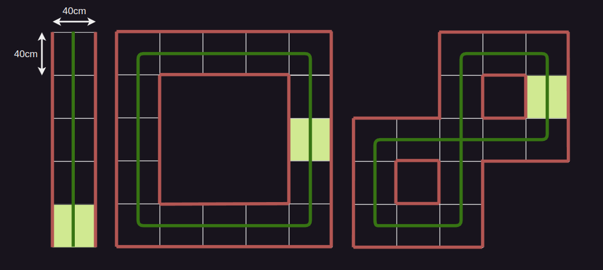

# Lab 12 - Midterm Test (Corridor Following)

Responsible: Ing. Adam Ligocki, Ph.D.

Up to 50 points can be earned through two practical demonstrations during the semester.

Week 8 — Line following (25 points)

Week 12 — Corridor following (25 points)

## Corridor following rules

There are 3 tracks:
- Straight corridor (5 points)
- Simple loop (10 points)
- Complex loop (10 points)

The corridor is defined by walls.

All tracks use a rectangular grid of 0.40 × 0.40 m.

Cells are marked by black tape on the ground.

Points are awarded only for completing the entire track:
- Pass the straight corridor without touching the wall.
- Complete the full loop.
- Do not touch the walls.
- Do not enter the same cell more than once.

Teams have 3 attempts per track, with a time limit of 3 minutes per attempt.

All 3 attempts must be performed during a single lab session.

## Test tracks

- Walls: red lines
- Path: green line
- Start: green cell

