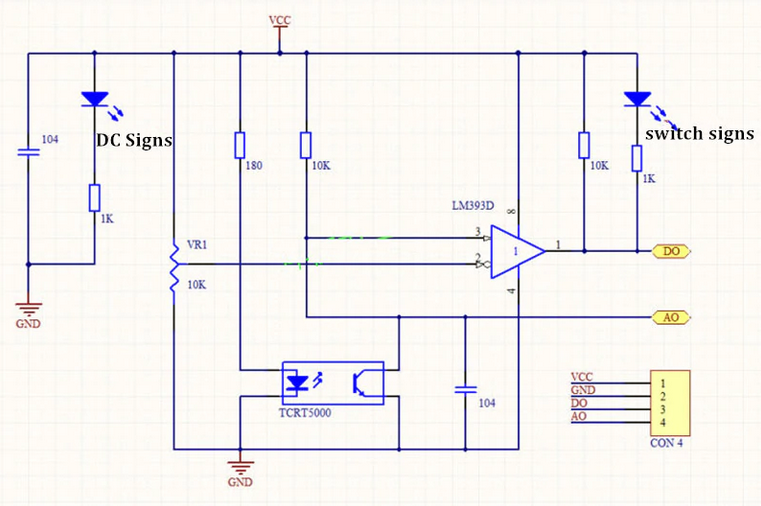
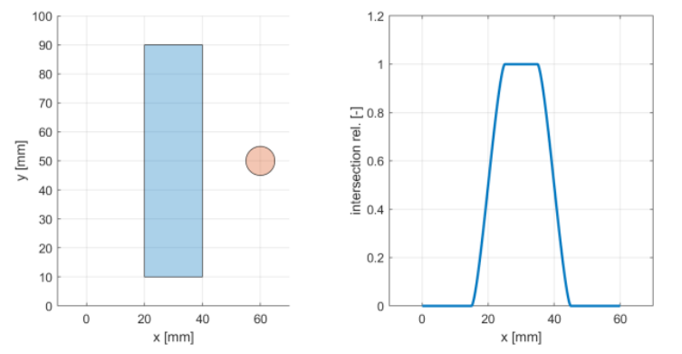

# Lab 6 - Line Estimation

Responsible: Ing. Adam Ligocki, Ph.D.

## Line Sensor Usage (1h)

In the first section we are going to write a basic interface with the line sensor backend and we will study the raw data.

### Line Sensor Explained

We are using the `TCRT5000` line sensor. 

It consists of an infrared LED and a phototransistor placed next to each other. When powered, the LED emits infrared light, and if a reflective surface (such as a white line) is placed in front of it, the phototransistor detects the reflected signal. The amount of reflected light changes depending on the color and surface characteristics of the object below the sensor, allowing the TCRT5000 to distinguish between light and dark areas. By interpreting the output of the phototransistor, microcontrollers or other circuitry can determine whether the sensor is over a reflective (light) line or a non-reflective (dark) background, enabling robust line tracking and detection functionality.



Schamatics from: https://osoyoo.com/2017/08/15/tcrt5000-infrared-line-tracking-sensor/

To understand the output value of the line sensor, please study and understand the following sensor characteristics.



If the sensor is above the dark line, there is no interaction between the IR LED and phototransisor. The phototransistor is closed and the voltage produce large voltage on the analog output.

If the sensor is above the white (reflective) surface, the IR light from photodiode opens transistor and the analog output `A0` is grounded. The voltage drops low.

Study the slope of the characteristics and discuss the sensor range.

### Differential Sensor Usage

Consider using two line sensors in the differential connection. One sensor is considered as a signal with positive sign and the other sensor is considered as a sensor with negative sign.

If we make a cleaver design, we can get a very good guess of robot's position relative to the line just by adding the sensor output values together.

.

What about the gap in between the sensors? How it effects line following process?

### Line Node Implementation

Now it is time to implement the `LineNode`, the class that will receive data and encapsulate the line estimation process for the rest of the program.

Create a new files according to you project's code conventions and implement the data receiving from the `/bpc_prp_robot/line_sensors`.

The message on the `/bpc_prp_robot/line_sensors` topic is of the `std_msgs::msg::UInt16MultiArray` type.

```c++
    enum class DiscreteLinePose {
        LineOnLeft,
        LineOnRight,
        LineNone,
        LineBoth,
    };
    
    class LineNode : public rclcpp::Node {
    public:
        
        LineNode();
        
        ~LineNode();

        // relative pose to line in meters
        float get_continuous_line_pose() const;
    
        DiscreteLinePose get_discrete_line_pose() const;
    
    private:
  
        rclcpp::Subscription<std_msgs::msg::UInt16MultiArray>::SharedPtr line_sensors_subscriber_;
    
        void on_line_sensors_msg(std::shared_ptr<std_msgs::msg::UInt16MultiArray> msg);
    
        float estimate_continuous_line_pose(float left_value, float right_value);
    
        DiscreteLinePose estimate_descrete_line_pose(float l_norm, float r_norm);
    };
```

Run the program and try to print out the measured values.

## Line Position Estimation (1H)

In this section we will focus on the line position estimation. Our target is to write a class that will encapsulate line position estimation. The input of this algorithm is the left and right sensor values. The output is both, the discrete or Continuous position of the robot relativelly to the line.  

Try to develop this class by the [Test Driven Development](https://en.wikipedia.org/wiki/Test-driven_development). First write tests, than implement the algorithm.

```c++

#include <iostream>
#include <gtest/gtest.h>
TEST(LineEstimator, line_estimator_test_1) {
    uint16_t left_value = 0;
    uint16_t right_value = 1024;
    auto result = LineEstimator::estimate_discrete(left, right);
    
    EXPECT_EQ(result, /* ... */);
}

// ...

int main(int argc, char **argv) {
    ::testing::InitGoogleTest(&argc, argv);
    return RUN_ALL_TESTS();
}
```

By separating the line estimation algorithm into separated class, you will improve the test writing experience compared to the line estimation directly in the `LineNode` class.

### Discrete Approach

Write and test method that will provide your future program with discrete position of the robot relative to the line. See previous examples. 

### Continuous Approach

Try the same for the continuous domain. Sensor's raw values on input and float or double value on the output. Tip: scale output to SI units.

## Line Sensor Calibration and Arrangement (1h)

Lorem Ipsum

### How to calibrate sensor

Lorem Ipsum

### Sensor arrangement

Lorem Ipsum