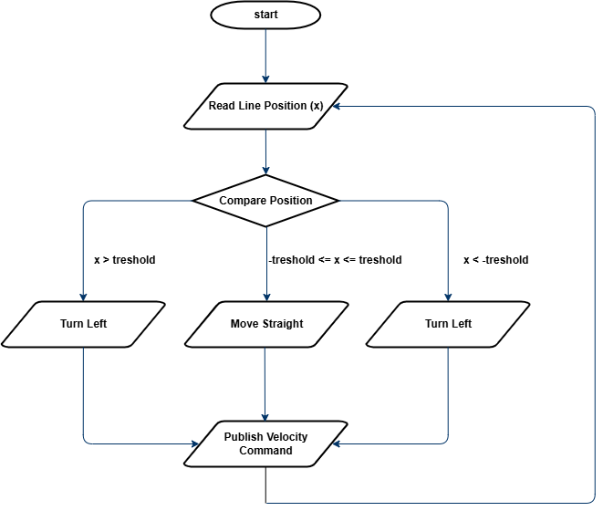
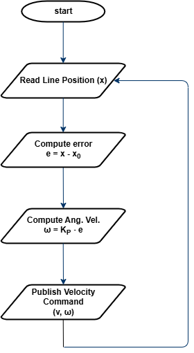
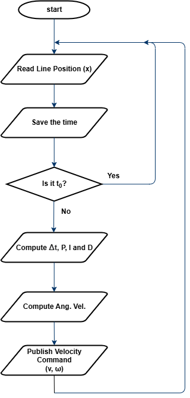

# Lab 6 - Line Following & PID

**Responsible:** Ing. Petr Šopák

## Learning objectives

1) **Bang-Bang Line Following (ON/OFF Control)**
2) **Line Following with P-Control**
3) **Line Following with PID Control**

In previous lab sessions, *you developed ROS 2 nodes for*:
- *Collecting data* from reflection-based sensors
- *Estimating the position* of a line
- *Controlling the robot's motion*

Now, your task is to develop a **strategy for line following** – that is, responding to the estimated line position and ensuring the robot tracks the line correctly. You will start with the *simplest approach* (Bang-Bang control) and progressively refine it to implement *PID regulation*.

For more details, see the Line following chapter: [Line following](../../3_navigation/text/3_line_following.md).

## Bang-Bang Line Following (Approx. 1 hour)

Bang-Bang is the most basic control method. Instead of smoothly adjusting the speed, the robot makes **hard, discrete decisions** based on sensor readings. Think of it as a light switch – either ON or OFF:

1. Line is detected on the left → Turn right
2. Line is detected on the right → Turn left
3. Line is centered → Move straight

This method **can be implemented using either digital or analog sensor outputs**. Since digital outputs already behave like ON/OFF signals, Bang-Bang logic is straightforward. However, in this lab, we will focus on the **analog output**, which requires setting a threshold to decide when the robot should turn.

The entire algorithm is illustrated in [Figure 1](#bangDiagram). The process consists of reading the estimated line position and comparing it to a **user-defined threshold**. Based on this comparison, the robot's movement is determined.

The flowchart provides a **generalized structure** for Bang-Bang control. However, the specific **comparison logic** and the **velocity values** sent to the wheels **depend on your own implementation**. It is up to you to decide how to structure the control logic in your code.

<p id="bangDiagram" align="center">
  
</p>
<p align="center">
    <em> Figure 1: Flowchart for Bang-Bang Control </em>
</p>

To fine-tune the performance, it is recommended to start with a **higher threshold and gradually decrease it**. Observe how the robot’s behavior changes and try to understand why this approach leads to better results.

----------------------------------------------------------------------------------------------
**TASK 1**
1) Project Structure:
  - Inside the `src` and `include` directories, create a new folder named `loops`.
  - In this folder, create two files: `line_loop.cpp` and `line_loop.hpp`.
  - These files will define a ROS 2 node that implements a periodic control loop using a timer callback (e.g., `line_loop_timer_callback()`).
  - The loop should regularly read the estimated line position, compute the control action, and send appropriate speed commands to the robot's motors.
2) Implement **Bang-Bang Line Control** based on the guidelines provided in the lab description.
3) Experiment with different threshold values and observe how the robot behaves and analyze the **advantages and limitations** of Bang-Bang control.

## Line Following with P-Control (Approx. 1 hour)

Now you will refine your line-following strategy by implementing **Proportional Control (P-Control)**. Unlike Bang-Bang control, which causes abrupt movements, P-Control allows the robot to adjust its movement smoothly based on how far the estimated line position deviates from the robot’s center. The goal is to achieve smoother and more stable tracking of the line.

**Previously you implemented Bang-Bang control**, which relied on strict ON/OFF decisions. This approach worked but led to **oscillations and jerky movement**, as the robot continuously switched between turning left and right. These issues make it **difficult for the robot to follow curves or move efficiently at higher speeds**.

Proportional control solves this by introducing a **continuous adjustment** to the robot’s turning speed. Instead of making binary decisions, the angular velocity *ω* is determined using a **proportional gain *K<sub>P</sub>*** and the error *e*, which represents the difference between the estimated line position *x* and the robot's center *x<sub>0</sub>*:

$$
e = x - x_{0}
$$

By multiplying this error by *K<sub>P</sub>*, we obtain the angular velocity:

$$
ω = K_{P} \cdot e
$$

This means that when the robot is **far from the center**, it **turns more sharply**. When it is **close to the center**, it makes **minor corrections**. If the line is perfectly centered, the robot moves straight. The higher the proportional gain *K<sub>P</sub>*, the stronger the response to the error. However, if *K<sub>P</sub>* is too high, the robot may start oscillating.

The process of P-Control is illustrated in [Figure 2](#pContDiagram). The robot reads the estimated position of the line, calculates the error, applies the proportional formula to determine angular velocity, and then sends this velocity to the motion control node, which executes the movement.

<p id="pContDiagram" align="center">
  
</p>
<p align="center">
    <em> Figure 2: Flowchart for P-Control Line Follower </em>
</p>

A key part of implementing P-Control is choosing the right value for *K<sub>P</sub>*. If *K<sub>P</sub>* is too small, the robot will react very slowly and may fail to follow the line accurately. If *K<sub>P</sub>* is too large, the robot might oscillate too much and become unstable. The best approach is to start with a low value of *K<sub>P</sub>* and gradually increase it, observing how the robot’s movement improves.

------------------------------------------------------------------
**TASK 2**
1) Insert the provided `pid.hpp` file into the `include/algorithms` directory. This header defines a basic PID controller class, which you will use for both **Task 2 (P-control)** and **Task 3 (full PID)**.

  ```c++
  #pragma once

  #include <iostream>
  #include <chrono>
  
  namespace algorithms {
  
      class Pid {
      public:
          Pid(float kp, float ki, float kd)
              : kp_(kp), ki_(ki), kd_(kd), prev_error_(0), integral_(0) {}
  
          float step(float error, float dt) {
              integral_ += error * dt;
              float derivative = (error - prev_error_) / dt;
              float output = kp_ * error + ki_ * integral_ + kd_ * derivative;
              prev_error_ = error;
              return output;
          }
  
          void reset() {
              prev_error_ = 0;
              integral_ = 0;
          }
  
      private:
          float kp_;
          float ki_;
          float kd_;
          float prev_error_;
          float integral_;
      };
  }
  ```

2) Reuse your `LineLoop` class from Task 1 and modify the control logic inside `line_loop_timer_callback()` to implement a **Proportional controller**.
3) Experiment with different values of the proportional gain *K<sub>P</sub>* and determine the most suitable value.
4) Observe the performance and assess if further refinement is needed.
5) Write simple unit tests for the `Pid` class in a separate file named `pid_test.cpp`. Here's an example that tests the response of the P-controller to a unit step input:

  ```c++
  #include "algorithms/pid.hpp"
  #include <iostream>
  #include <cassert>
  #include <cmath>
  
  using namespace algorithms;
  
  bool nearly_equal(float a, float b, float eps = 1e-5f) {
      return std::fabs(a - b) < eps;
  }
  
  // Unit step input (constant error = 1.0)
  void test_unit_step() {
      Pid pid(2.0f, 0.0f, 0.0f); // P-only
      float dt = 0.1f;
  
      float error = 1.0f;
  
      for (int i = 0; i < 5; ++i) {
          float output = pid.step(error, dt);
          assert(nearly_equal(output, 2.0f));
      }
  
      std::cout << "[PASS]\n";
  }

  int main() {
      test_unit_step();
  
      std::cout << "All P-controller tests passed.\n";
      return 0;
  }

  ```

## Line Following with PID Control (Approx. 1 hour)

In this part, you will refine your **P-Control implementation** by adding **Integral (I)** and **Derivative (D)** components, creating a **PID controller**. This will improve stability, reduce oscillations, and enhance the robot’s ability to follow curves accurately.

While **P-Control** adjusts the robot’s angular velocity based on the current error, it **does not account for past errors or predict future corrections**. This can result in oscillations or slow responses in certain situations. **PID control** solves these issues by incorporating two additional terms:

$$
ω = K_{P}e + K_{i}\int e dt + K_{d}\frac{de}{dt}
$$

- **$$K_{P}e$$ (Proportional term)**: Reacts to the current error.
- **$$K_{i}\int e dt$$ (Integral term)**: Corrects accumulated past errors.
- **$$K_{d}\frac{de}{dt}$$ (Derivative term)**: Predicts future errors and reduces overshooting.

The **integral term** helps eliminate steady-state errors, ensuring the robot remains centered over time. The **derivative term** improves responsiveness by counteracting rapid changes, preventing overshooting and oscillations.

The overall process is illustrated in [Figure 3](#pidContDiagram). The robot reads the estimated line position, computes the error, applies the PID formula, and sends the adjusted velocity command to the motion control node.

<p id="pidContDiagram" align="center">
  
</p>
<p align="center">
    <em> Figure 3:  Flowchart for PID Control </em>
</p>

Tuning *K<sub>P</sub>*, *K<sub>i</sub>*, *K<sub>d</sub>* is essential for optimal performance. If *K<sub>P</sub>* is too high, the robot may oscillate. If *K<sub>i</sub>* is too high, the robot may overcorrect. If *K<sub>d</sub>* is too high, the robot may become too sensitive to small errors. A common approach is to start with only *K<sub>P</sub>*, then add *K<sub>d</sub>*, and finally add *K<sub>i</sub>* to eliminate steady-state error.

For more information on PID control implementation and tuning methods, see [PID](../../3_navigation/text/2_pid.md).

-----------------------------------------------------------------------------------------------
**TASK 3**
1) Just like in the previous tasks, extend your `LineLoop` class to **implement full PID control** using the provided `Pid` class. Also, don’t forget to **extend your unit tests** (`pid_test.cpp`) to verify the behavior of all PID components.
2) Choose a **tuning method** (either manual tuning or the Ziegler-Nichols method) and find the optimal values for *K<sub>P</sub>*, *K<sub>i</sub>*, *K<sub>d</sub>*.
3) Observe the differences between PID control and the previous line-following methods. Analyze how each component affects the robot’s performance.
4) (Optional) Implement output saturation (clamping). Real robots cannot turn infinitely fast. If your PID controller outputs a very large value (e.g. due to a sharp error), you should **limit (saturate) it to a safe range.**
5) (Optional) Implement anti-windup. The integral term in a PID controller can sometimes accumulate too much (especially when the output is saturated), which leads to overshooting or instability. This is called integral windup. To prevent this, implement anti-windup, for example disabling integration when output is saturated or limiting the maximum integral value.
