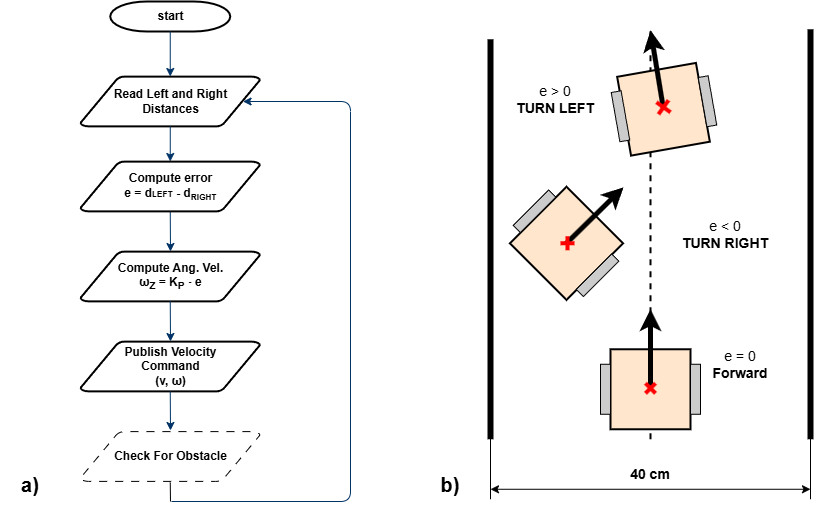

# Lab 9 - Obstacle Detection & Corridor Following

**Responsible:** Ing. Petr Šopák

## Learning objectives

**1) Understanding and working with LiDAR and/or Ultrasonic Sensors**
  -  Interpreting range data based on sensor principles
  -  Visualizing live sensor output in RViz2
    
**2) Implementing basic Obstacle Detection**
  - Detecting nearby obstacles
  - Implementing basic obstacle avoidance strategy  

**3) Implementing corridor following behavior**

--------------------------------------------------
    
In the previous labs, you implemented **line following** — the robot follows a visible line on the floor. This method is useful in controlled environments, such as factory floors or predefined paths. However, **line following relies on the presence of artificial markings** and provides limited flexibility in more general environments.

In this and the next labs, you will begin working on **corridor following**, a more natural and scalable navigation strategy. Instead of relying on a line, the robot uses **range sensors** (LiDAR or ultrasonic) to perceive the environment and **stay centered between two walls or obstacles**, like navigating a hallway. This approach is closer to what real autonomous robots do in indoor spaces, such as offices, hospitals, or warehouses.

You will first learn how to **interpret range data** and **detect nearby obstacles**. Then, you will **implement a simple reactive controller that enables the robot to stay within a corridor**.

## Understanding and working with LiDAR and/or ultrasonic sensors (Approx. 40 minutes)

In this part of the lab, you will get familiar with your chosen range sensor — either LiDAR or ultrasonic. You will explore how it measures distance, how the data is represented in ROS 2, and how to visualize it in RViz2. This will give you the foundation needed for obstacle detection and corridor following tasks in the rest of the lab.

> For these labs, please **choose one type of range sensor** — either ultrasonic or LiDAR. You will work with the selected sensor throughout the exercises.
> If you later decide to switch to the other sensor or want to use both for comparison or improvement, feel free to do so.
> The instructions are written to support both sensor types.

### A) Light Detection and Ranging (LiDAR) sensor

LiDAR sensors are commonly used in robotics to **measure precise distances to surrounding objects**. A LiDAR device emits rapid laser pulses and measures the time it takes for each pulse to bounce back from a surface. Using the known speed of light, it calculates the exact distance to each point. Most LiDARs used in mobile robots operate in 2D, scanning a horizontal plane around the robot to produce a range profile of the environment. This allows the robot to detect walls, obstacles, and open spaces with high accuracy and resolution.

**When implementing the tasks, please refer to the official documentation of the sensor. You can find the RPLIDAR A1 datasheet here:** [RPLIDAR A1 datasheet](https://www.generationrobots.com/media/rplidar-a1m8-360-degree-laser-scanner-development-kit-datasheet-1.pdf?srsltid=AfmBOooj2AiNYBC8o8kbJgSheC_A-9984T-XY20x4SDBgRdxRKcWEVNh)

----------------------------------------------------------------------------------------------
**TASK 1 - A**
1) **Explore the data** provided by the sensor - Inspect the raw data in the terminal (Refer to the datasheet if needed to understand parameters)
   > Understand the meaning of the main fields in the message: `angle_min`, `angle_max`, `angle_increment`, `ranges[]`, `range_max`, `range_min`.
2) **Visualize the LiDAR data** in RViz2
    1) Launch RViz2 and add a LaserScan display (Add → By Topic → LaserScan)
    2) Set the correct topic name and `Fixed Frame` as `lidar`
    3) (Optional) Customize the display: point size, color, decay time, etc.
    > Don’t forget to launch RViz2 in a sourced terminal; otherwise topics will not be visible.
3) **Create a new `ROS 2` node** for your LiDAR processing
    - Create `lidar_node.hpp` and `lidar_node.cpp` in `nodes` directories
    - In this node, **subscribe to the LiDAR topic and process incoming data**
4) **Think critically about the data**
    - Are all values in `ranges[]` useful for your application?
    > **TIP:** LiDAR may return very small values (e.g. 0) or extremely large values (inf). These are usually best ignored.
    - Do all directions matter for your robot’s task?
    > **TIP:** You can filter only specific angular sectors depending on what you need. (e.g. Front, Right, Left, Back)
    - (Optional) Example skeleton for implementing sector-based LiDAR filtering. You may use this as inspiration or create your own version:
    ```c++
    #include <cmath>
    #include <vector>
    #include <numeric>
    
    namespace algorithms {
    
        // Structure to store filtered average distances in key directions
        struct LidarFilterResults {
            float front;
            float back;
            float left;
            float right;
        };
    
        class LidarFilter {
        public:
            LidarFilter() = default;
    
            LidarFilterResults apply_filter(std::vector<float> points, float angle_start, float angle_end) {
    
                // Create containers for values in different directions
                std::vector<float> left{};
                std::vector<float> right{};
                std::vector<float> front{};
                std::vector<float> back{};
    
                // TODO: Define how wide each directional sector should be (in radians)
                constexpr float angle_range = ;
    
                // Compute the angular step between each range reading
                auto angle_step = (angle_end - angle_start) / points.size();
    
                for (size_t i = 0; i < points.size(); ++i) {
                    auto angle = angle_start + i * angle_step;
    
                    // TODO: Skip invalid (infinite) readings
    
                    // TODO: Sort the value into the correct directional bin based on angle
                    
                }
    
                // TODO: Return the average of each sector (basic mean filter)
                return LidarFilterResults{
                    .front = ,
                    .back = ,
                    .left = ,
                    .right = ,
                };
            }
        };
    }
    ```
    
### B) Ultrasonic sensors

Ultrasonic sensors are widely used in robotics for short-range obstacle detection. They work by emitting a high-frequency sound wave and measuring the time it takes for the echo to return after bouncing off an object. Unlike LiDAR, ultrasonic sensors typically measure in a narrow cone, and their readings can be affected by surface material, angle, or ambient noise. They are cost-effective, but require more filtering and careful placement to be reliable.

**When implementing the tasks, please refer to the official documentation of the sensor. You can find the HY-SRF05 datasheet here:** [HY‑SRF05 datasheet](https://dratek.cz/arduino/1735-meric-vzdalenosti-ultrazvukovy-5pin-hy-srf05-pro-arduino.html?gad_source=1&gclid=Cj0KCQiAr7C6BhDRARIsAOUKifhd7u9T5IjiCyc4w0n-WqehlzG5F2pNwJ4JP5M_eQDHW-daU_NkSKYaAn-_EALw_wcB)

----------------------------------------------------------------------------------------------
**TASK 1 - B**
1) **Explore the data** provided by the sensor — Inspect the raw data in the terminal (refer to the datasheet if needed to understand parameters — min/max measurable range, FOV, etc.)
2) **Visualize the data** in rqt (or RViz2 — use the Range display)
3) **Create a new ROS 2 node** for processing ultrasonic data
    - Create `ultrasonic_node.hpp` and `ultrasonic_node.cpp` in `nodes` directories
    - In this node, **subscribe to the topic and process incoming data**
4) **Think critically about the data**
    - What do the sensor values actually represent?
    - Are the sensor readings stable and consistent over time?
    > **TIP:** Data is often affected by noise, reflections, and material properties. You may want to ignore extreme or invalid values. Consider applying filtering, such as a moving average or median filter
    - If needed, implement a simple filtering algorithm to reduce noise or focus only on relevant angles (e.g. front, sides)

## Implementing basic Obstacle Detection (Approx. 40 minutes)

Use your chosen sensor (LiDAR or ultrasonic) to detect whether an object is too close to the robot — for example, less than 0.30 m in front. If an obstacle is detected, the robot should stop and wait instead of continuing forward. This simple reactive behavior is an essential first step toward more advanced navigation strategies such as obstacle avoidance, corridor following, or autonomous path planning.

----------------------------------------------------------------------------------------------
**TASK 2**
1) **Create a new ROS 2 node** called `corridor_loop` in the `loops` directory. This node should be similar to the `line_loop` from the previous labs. In this node, you will gradually implement the entire functionality for *Corridor Following*
2) Use the sensor data from *Task 1*. Based on this data, **implement a simple algorithm for Obstacle Detection**:
  1) Retrieve the data from the sensors
  2) If the reading is **below a threshold you define**, this means the **robot is close enough to detect the obstacle**
3) **Test the obstacle detection** to ensure the robot detects objects correctly when they are within the defined range.
4) **Create basic obstacle avoidance** logic:
  1) Make the robot drive forward
  2) When an obstacle is detected, the robot **must stop and not continue moving!**

> More **advanced avoidance behaviors** (e.g., turning) will be covered in the next lab.

## Implementing corridor following behavior (Approx. 60 minutes)

*Corridor following* allows the robot to stay centered between two walls by adjusting its heading based on distance measurements from both sides. In this task, you will use your sensor data (e.g. LiDAR or ultrasonic) to calculate the lateral error (difference between left and right distances) and correct the robot’s trajectory using proportional control.

<p id="bangDiagram" align="center">
  
</p align="center">
<p>
    <em> Figure 1: Corridor following behavior. a) <strong>Flowchart</strong> of the corridor following algorithm; b) Robot behavior based on the computed lateral error <code>e</code>. </em>
</p>

----------------------------------------------------------------------------------------------
**TASK 3**
1) **Implement the corridor-following algorithm** based on the flowchart displayed above.
2) **Test and tune the algorithm** to find the optimal solution for corridor following. (You may use the `pid.hpp` for advanced control if desired.)

> **Note:** It is recommended to test corridor following in environments where the turns are not too sharp. This issue will be addressed in the next lab.
