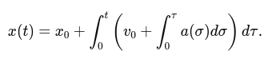
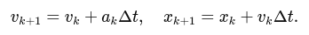

# IMU (Inertial Measurement Unit)

Note: in this tutorial, by using the "gyroscope" word, we mean angular speed sensor. Properly said, the gyroscope is device that keeps constant orientation.

In this tutorial, we will focus on how to process data from an Inertial Measurement Unit (IMU) to estimate orientation and position along a single degree of freedom (DoF). While an actual IMU measures 3-axis accelerations (from an accelerometer) and 3-axis angular velocities (from a gyroscope), we will simplify the problem by considering only one-dimensional motion and rotation. This simplification helps you gain intuition before extending the logic to three dimensions.

Key concepts:
 - Angular velocity to orientation: If you know how fast something is rotating, you can integrate that angular rate over time to find how far it has rotated.
 - Acceleration to position: If you know the acceleration of something, you can integrate it once to get its velocity, and integrate again to find its position.

This tutorial will walk you through the math and give you a step-by-step procedure, along with a conceptual example and code snippets.

## Sensor Data and Assumptions

An IMU in one dimension can be thought of as providing two main signals:

 - Angular velocity, `ω(t)`, measured in radians per second `(rad/s)`. In a real IMU, this would come from the gyroscope (angular speed meter).
 - Linear acceleration, `a(t)`, measured in meters per second squared `(ms^-2)`. In a real IMU, this would come from the accelerometer.

Assumptions to Simplify the Task:

 - We assume motion and rotation occur along a single axis.
 - Gravity effects may be ignored or assumed to be pre-compensated. In practice, you must carefully handle gravity, but for this tutorial, we focus on the mechanics of integration only.
 - Noise and biases in the sensors are not considered for now. In reality, these need filtering and calibration.
 - Initial conditions (initial orientation and position) are known.

Notation and Variables:

 - Let `θ(t)` represent the orientation (angle) at time `t`.
 - Let `x(t)` represent the position at time `t`.
 - Given data: `ω(t)` and `a(t)`.
 - Known initial conditions: `θ(0) = θ` and `x(0) = x`, and possibly initial velocity `v(0) = v0`.

## From Angular Velocity to Orientation

Orientation (in 1D, simply an angle) is related to angular velocity by the first-order differential equation:

<p></p>

To obtain `θ(t)`, you integrate the angular velocity over time:

<p></p>

If you sample `ω` at discrete time steps `tk = kΔt` (where `Δt` is the sampling period), you can approximate the integral numerically. A simple numerical integration (Euler method) is:

<p></p>

Here, `θk` and `ωk` are the angle and angular velocity at the kk-th timestep.

## From Linear Acceleration to Position

The position is related to acceleration by two integrations:

Acceleration to velocity:

<p></p>

Velocity to position:

<p></p>

Combining these, we get:

<p></p>

For discrete time steps, using Euler integration:

Update velocity:

<p></p>

Update position:

<p></p>

Note that the velocity used to update the position can be the already updated velocity `(vk+1)` or the old one `(vk)`, depending on your numerical integration choice. The simplest Euler method uses the old values:


<p></p>

But for clarity and consistency, you might update position using the updated velocity if you wish (this is a matter of integration scheme choice; either is acceptable for this tutorial).

## Step-by-Step Example

### Setup:

Assume a sampling frequency of `fs = 100 Hz` (`Δt = 0.01s`).

Suppose we have a constant angular velocity `ω = 0.1 rad/s` and a constant acceleration `a = 0.2 m/s`.

Initial orientation: `θ0 = 0 rad`.

Initial velocity: `v0 = 0 m/s`.

Initial position: `x0 = 0 m`.

### Orientation Calculation:

`θk+1 = θk + ωkΔt`.

Since `ωk = 0.1 rad/s` is constant, after one step:

<p></p>

After 100 steps (1 second):

<p></p>

### Position Calculation:

Velocity update:

<p></p>

After the first step:

<p></p>

Position update:

<p></p>

(Since initial velocity is zero, position doesn't change in the first iteration.)

Next step:

<p></p>

## Practical Considerations

 - Noise and Biases: Real IMU data is noisy. Integrating noisy data leads to drift. In practice, filtering (e.g., using a Kalman filter or complementary filter) is essential.
 - Gravity Compensation: If you are working in 3D, you must subtract the gravity vector from the accelerometer reading to isolate the linear acceleration. In 1D, if your axis is aligned vertically, you must subtract out `g = 9.81 ms^-2`.
 - Sampling Rate and Integration Method: We used a simple Euler method. More accurate integration schemes (e.g., trapezoidal, Runge-Kutta) can improve accuracy.

## Example Code

```python
import numpy as np
import matplotlib.pyplot as plt

# Simulation parameters
fs = 100.0              # sampling frequency (Hz)
dt = 1.0/fs             # time step
t_end = 5.0             # total duration (s)
t = np.arange(0, t_end, dt)

# Given sensor readings (for demonstration)
omega = 0.1 * np.ones_like(t)  # rad/s
a = 0.2 * np.ones_like(t)       # m/s^2

# Initial conditions
theta_0 = 0.0
x_0 = 0.0
v_0 = 0.0

# Allocate arrays for orientation, velocity, and position
theta = np.zeros_like(t)
v = np.zeros_like(t)
x = np.zeros_like(t)

theta[0] = theta_0
v[0] = v_0
x[0] = x_0

# Numerical integration
for k in range(len(t)-1):
    # Integrate orientation
    theta[k+1] = theta[k] + omega[k]*dt

    # Integrate velocity
    v[k+1] = v[k] + a[k]*dt

    # Integrate position
    x[k+1] = x[k] + v[k]*dt

# Plot results
plt.figure(figsize=(12,6))

plt.subplot(3,1,1)
plt.plot(t, theta, label='Orientation (rad)')
plt.xlabel('Time (s)')
plt.ylabel('Theta (rad)')
plt.title('Orientation from Angular Velocity')

plt.subplot(3,1,2)
plt.plot(t, v, label='Velocity (m/s)')
plt.xlabel('Time (s)')
plt.ylabel('Velocity (m/s)')
plt.title('Velocity from Acceleration')

plt.subplot(3,1,3)
plt.plot(t, x, label='Position (m)')
plt.xlabel('Time (s)')
plt.ylabel('Position (m)')
plt.title('Position from Acceleration')

plt.tight_layout()
plt.show()
```

<p></p>

Tip: Try to add some random noise to measured signals.

## Advanced Topics (future robotics courses)

 - Extend the logic to 3D, working with vectors and rotation representations (e.g., Euler angles, quaternions).
 - Implement filtering techniques to handle noise (e.g., a complementary filter to fuse accelerometer and gyroscope data).
 - Learn how to remove gravity from the accelerometer measurements in real-world scenarios.
 - Implement full 3D orientation estimation with drift compensation (lin acc to estimate gravity direction, gyro for quick orientation updates).
