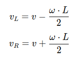

# Differential Chassis

The differential drive chassis is one of the most common configurations for mobile robots. It consists of two independently controlled wheels mounted on the same axis and optionally a passive caster wheel for stability.

This tutorial introduces the fundamental concepts of differential drive kinematics and demonstrates how to derive the forward and inverse kinematics equations.

## Components of a Differential Drive Chassis

 - Two wheels: Independently driven, providing linear and rotational motion.
 - Chassis: Holds the wheels, motors, and sensors.
 - Center of the robot: Defined as the midpoint between the two wheels.
 - Wheel radius (`r`): Radius of each wheel.
 - Wheel separation (`L`): Distance between the two wheels.

## Kinematic Model

Pose `(x,y,θ)`: The robot's position `(x,y)` and orientation `θ` in a 2D plane. `[m, m, rad]`

Linear velocity `(v)`: Forward speed of the robot. `[m/s]`

Angular velocity `(ω)`: Rate of rotation of the robot. `[rad/s]`

Conventions:
- Coordinate frame: x points forward, y points to the left (right-handed frame).
- Positive angular velocity `ω` is counter-clockwise (CCW).
- Wheel linear speeds `v_L`, `v_R` are positive when rolling forward.

## Wheel Velocities

Left wheel angular velocity: `ω_L`
Right wheel angular velocity: `ω_R`

The linear velocities of the wheels are (v_L = r·ω_L, v_R = r·ω_R):

<p></p>

## Forward Kinematics

Forward kinematics calculates the robot's linear and angular velocities based on wheel velocities.

### Linear and Angular Velocities

The robot's linear velocity `(v)` and angular velocity `(ω)` are:

<p></p>

#### Turning radius and ICC
- Instantaneous Center of Curvature (ICC) lies at distance `R = v/ω` from the robot center, to the left for `ω > 0` and to the right for `ω < 0`.
- Special cases:
  - Straight motion: `ω = 0` → `R = ∞`.
  - In-place rotation: `v = 0`, `ω ≠ 0` → `R = 0` (wheels spin in opposite directions with equal speed).

### Pose Update

Given the robot's current pose `(x,y,θ)`, the new pose after a small time step `dt` can be computed as:

<p></p>

## Inverse Kinematics

Inverse kinematics computes the wheel velocities required to achieve a desired linear and angular velocity.

Given:
 - Desired linear velocity `v`.
 - Desired angular velocity `ω`.

The wheel velocities are:

<p></p>

To compute angular velocities:

<p></p>

## Example Code

```python
def forward_kinematics(v_L, v_R, L):
    v = (v_R + v_L) / 2
    omega = (v_R - v_L) / L
    return v, omega
```

```python
import math

def update_pose(x, y, theta, v, omega, dt):
    x_new = x + v * math.cos(theta) * dt
    y_new = y + v * math.sin(theta) * dt
    theta_new = theta + omega * dt
    # Optional: normalize heading to [-pi, pi)
    if theta_new > math.pi:
        theta_new -= 2 * math.pi
    elif theta_new <= -math.pi:
        theta_new += 2 * math.pi
    return x_new, y_new, theta_new
```

```python
def inverse_kinematics(v, omega, L):
    v_L = v - (omega * L / 2)
    v_R = v + (omega * L / 2)
    return v_L, v_R
```

## Exercise

Write a program that simulates a differential-drive chassis based on the given input parameters.

### Simulation Parameters

 - Wheel radius: `r = 0.1 m`
 - Wheel separation: `L = 0.15 m`
 - Time step: `dt = 0.01 s`

### Tasks

 - Compute the pose of the robot after moving straight for 5 seconds with `v = 1 m/s`.
 - Simulate a circular motion with `v = 1 m/s` and `ω = 0.5 rad/s`. 
 - Simulate a circular motion with `v_L = 1.0 m/s` and `v_R = 0.5 m/s`.
 - Optional: If using wheel angular speeds instead, compute `v_L = r·ω_L` and `v_R = r·ω_R` first.