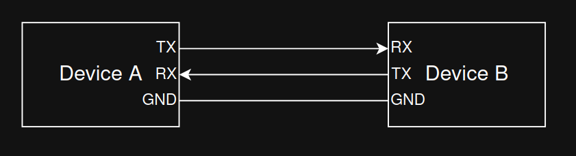
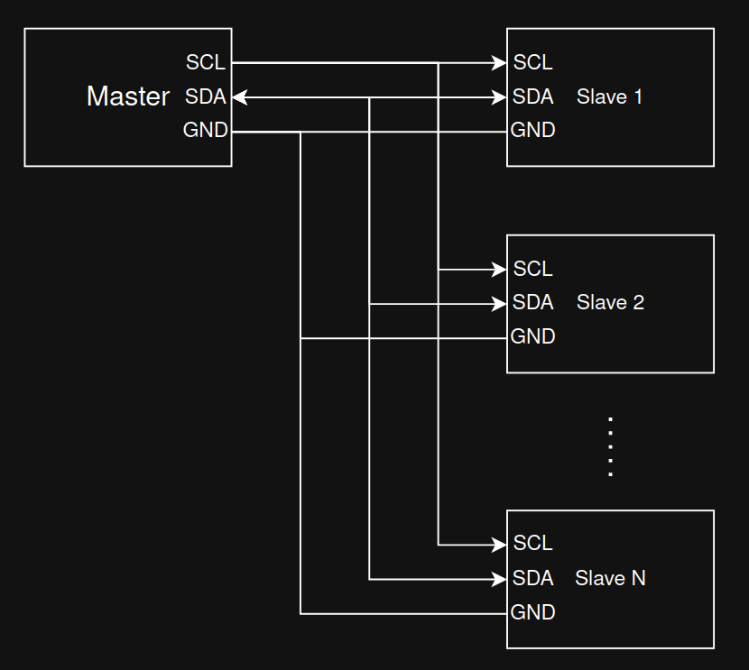

# Communication Buses

This chapter summarizes four common serial buses used in embedded systems and robotics: UART, I2C, SPI, and CAN. For each, you’ll find the wiring, what problem it solves, typical speeds, and practical tips.

## UART

A UART (Universal Asynchronous Receiver/Transmitter) sends and receives serial data one bit at a time over two data lines without a shared clock.

UART topology:

Key characteristics:
- Asynchronous: No clock line. Both ends must agree on the baud rate (bits per second).
- Signals: TX (transmit), RX (receive). Optional flow control lines RTS/CTS may be present.
- Frame format: start bit, 5–9 data bits (commonly 8), optional parity (even/odd/none), and one or two stop bits. Example: 8N1 = 8 data bits, no parity, 1 stop bit.
- Voltage levels: Commonly TTL/CMOS (e.g., 3.3 V or 5 V) on microcontrollers; classic RS‑232 levels are higher and inverted and require a level shifter (e.g., MAX232).
- Typical speeds: 9,600; 57,600; 115,200 baud; many MCUs support higher.

With UART, reliable communication requires matching configuration on both ends (baud rate, data bits, parity, stop bits). Parity can detect single‑bit errors but not correct them.

UART timing:

Image source: https://vanhunteradams.com/Protocols/UART/UART.html

## I2C

I2C (Inter‑Integrated Circuit) is a synchronous two‑wire bus intended for short‑range, on‑board communication.

I2C topology:

Key characteristics:
- Wires: SDA (data) and SCL (clock). Lines are open‑drain/open‑collector and require pull‑up resistors.
- Roles: Master and slave; multi‑master is supported by the spec but less common in simple designs.
- Addressing: 7‑bit (typical). Devices respond to their address; no separate chip‑select lines.
- Speeds: Standard (100 kHz), Fast (400 kHz), Fast Mode Plus (1 MHz), High‑Speed (3.4 MHz). Effective throughput is lower due to protocol overhead and clock stretching.
- Electrical: Keep bus traces short; choose appropriate pull‑up values based on capacitance and desired rise time.

Because I2C uses only two wires shared by many devices (and GND), it’s ideal for connecting multiple sensors or peripherals at modest speeds.

I2C timing:

Image source: https://www.youtube.com/watch?v=CAvawEcxoPU

## SPI

SPI (Serial Peripheral Interface) is a fast, full‑duplex serial bus commonly used for sensors, displays, and memory devices.

SPI topology:

Key characteristics:
- Wires: SCLK (clock), MOSI (master out, slave in), MISO (master in, slave out), and one CS/SS (chip select) per slave.
- Full‑duplex: Data can be transmitted and received simultaneously.
- Modes: Defined by clock polarity (CPOL) and clock phase (CPHA); four modes (0–3). Master and slave must use the same mode and bit order (MSB‑first is common).
- Speed: Often several MHz to tens of MHz depending on hardware and wiring quality.
- Topology: One CS line per device is simplest. Daisy‑chain is possible with some devices but less common.

SPI does not use addresses; the master selects a single slave by asserting its CS line.

SPI timing:

Image source: https://www.youtube.com/watch?v=0nVNwozXsIc

## CAN

CAN (Controller Area Network) is a robust, differential multi‑drop bus designed for reliability in noisy environments (originally automotive, now used widely in industry and robotics).

CAN topology:

Key characteristics:
- Physical layer: Two wires (CAN‑H, CAN‑L) with 120 Ω terminations at both ends of the main bus. Keep stubs short to reduce reflections.
- Arbitration: Messages have identifiers (11‑bit standard, 29‑bit extended). Non‑destructive arbitration ensures that the highest‑priority (lowest ID) message wins if multiple nodes transmit simultaneously.
- Frames and reliability: Frames contain SOF, arbitration field (ID), control/DLC, data (0–8 bytes for Classical CAN), CRC, ACK, and EOF. Strong error detection, automatic retransmission, and error confinement.
- Bit rates: Classical CAN up to 1 Mbit/s on short buses. CAN‑FD increases data field (up to 64 bytes) and allows higher data‑phase bit rates (e.g., 2–5 Mbit/s) on capable hardware.

Because of its priority‑based arbitration and error handling, CAN is well‑suited for safety‑critical or distributed control systems.

CAN data frame:

Image source: https://en.wikipedia.org/wiki/CAN_bus

## When to Use Which
- UART: Point‑to‑point links, simple device logs, GPS modules, Bluetooth modules; low pin count, modest speed.
- I2C: Many low/medium‑speed peripherals on the same PCB, minimal wiring; requires pull‑ups; address management needed.
- SPI: High‑speed peripheral access (displays, flash memory, camera); more pins but excellent throughput and timing control.
- CAN: Robust multi‑drop networking with priorities and error handling across meters of cable; ideal for vehicles and industrial robots.

## Resources
- UART overview: https://vanhunteradams.com/Protocols/UART/UART.html
- I2C specification (NXP user manual): https://www.nxp.com/docs/en/user-guide/UM10204.pdf
- SPI basics (Motorola/NXP app notes): https://www.nxp.com/docs/en/application-note/AN2910.pdf
- CAN bus (Wikipedia, overview): https://en.wikipedia.org/wiki/CAN_bus
- CAN‑FD (Bosch spec summary): https://www.bosch-semiconductors.com/ip-modules/can-fd/
