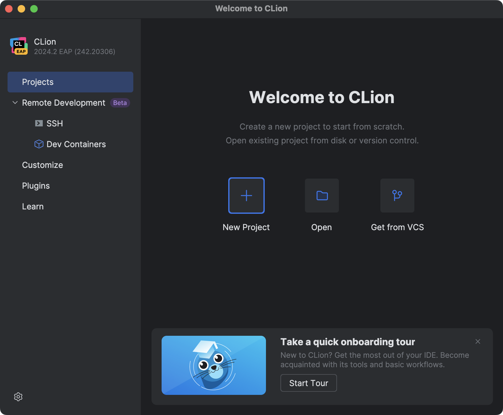
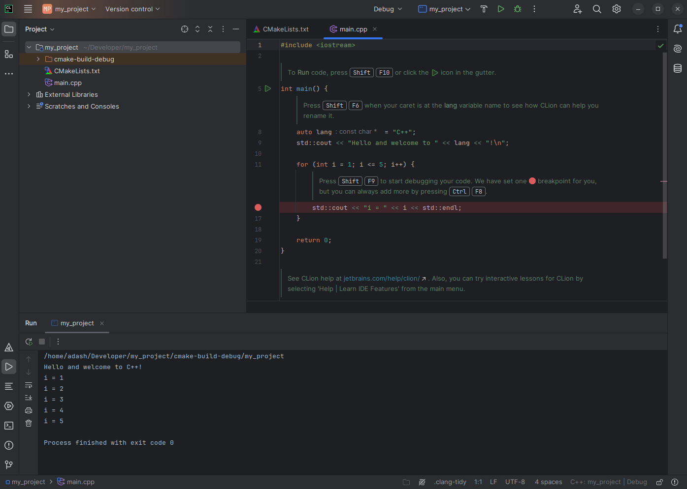

# CLion

CLion is a program made by JetBrains that helps people write and test code. It is similar to other coding programs like Eclipse or NetBeans but is faster, easier to use, and looks more modern.

Because CLion is part of the JetBrains family, users can add extra tools and languages by installing plugins. It also has built-in support for Git, which helps with managing code changes.

This guide explains how to use CLion for the BPC-PRP course. It starts with a short introduction to CMake, a tool used to build programs. Then, it explains how to install CLion, create a simple "Hello World" program, and run it.

The examples in this guide use CLion version 2018.3, so some steps might be different in newer versions.

## CLion Installation

There are two ways to install CLion
 - `sudo snap install clion --classic` in command line
 - download software from https://www.jetbrains.com/clion/.

Students can use the full version for free while they are studying. 

## Hello World Project

First, we will make a simple Hello World project to learn how to create a project, use the CLion environment, and develop on a local computer.

When you open CLion, you will see a welcome screen with a list of your recent projects. To start a new project, click the "New Project" button.

After clicking "New Project", a window will open where you can set up your project. Here, you can choose where to save the project and select the C++ language standard. For this guide, we will use C++17.

After clicking "Create," CLion will open the development environment, where you can start working on your project. The interface will look similar to the image below.

Let's take a closer look at the different parts of the screen and what they do.

1. Pane with the currently edited source code
2. Currently opened files
3. Files in the project
4. From left to right: project compilation, target selection, compile and run, compile and run in debug mode.

When the program starts, the console window appears, displaying the program's output. This is where you can see messages from your code, such as the "Hello, World!" text printed by your program. If there are any errors, they will also appear here, helping you debug your code.

If porogram debug started, the debug console and related controls appears.

## Integrated Tutorial

The current CLion version contains the onboarding tutorial. Follow it to learn more.

