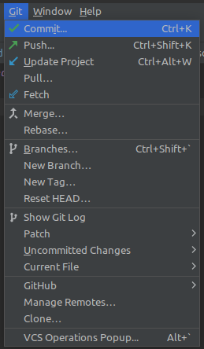
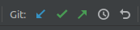
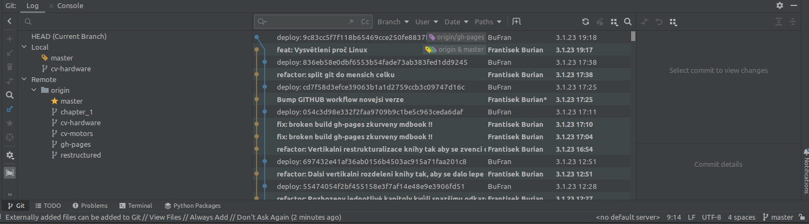

## Integrace GIT v CLionu 

GIT je integrován do CLion pomocí tří funkčních vstupů:

**Menu**

**Toolbar**

**Okno historie**

V toolbaru se nacházejí nejpoužívanější zkratky z menu, které jsou velmi snadno identifikovatelné pomocí ikonky.

Z **menu** lze aktivovat následující funkce:

  * [Potvrzení změn](git/commit.md)
  * [Odeslání na server](git/push.md)
  * [Aktualizace ze serveru](git/update.md)
  * Stažení a integrace změn ze serveru
  * Aktualizace odkazů na větve ze serveru
  * Sloučení větví
  * Překořenění větve
  * Zobrazení seznamu větví
  * Nová větev
  * Nový štítek
  * Zahodit změny
  * A další, málo používané operace

Z **okna historie** lze spustit následující funkce:

  * Prohlížení historie
  * Přepínání mězi větvemi
  * Vytvoření větve v konkrétním bodě historie
  * Sloučení větví 