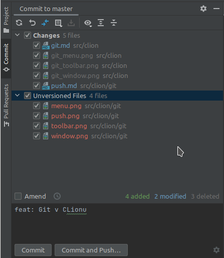

## CLion/GIT Potvrzení změn

Tuto funkci lze aktivovat z menu `Git`/`Commit` nebo kliknutím na zelenou ikonu zaškrtávátka:

Po aktivaci vyskočí v levé části okno (ve starých verzích to bylo samostatné okno).

V horní části můžete zaškrtnout které soubory chcete potvrdit, níže vepíšete text, který **stručně** popisuje tuto změnu 
a na spodní straně okna tlačítkem **Commit** potvrdíte změny.

**Pozor** Změny jsou uloženy pouze u vás, pokud je chcete zveřejnit, musíte provést [odeslání na server](push.md), nebo 
využít zkratky **Commit and push**