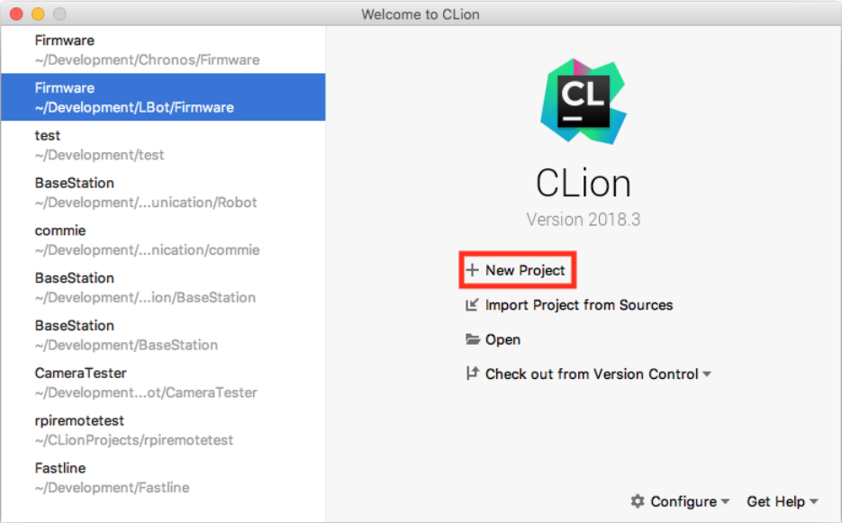

## Založení nového projektu

Nejprve vytvoříme jednoduchý HelloWorld projekt, ve kterém se seznámíme s procesem vytvoření projektu, prostředím a vývojem na lokálním počítači.
Po spuštění CLion nás přivítá úvodní obrazovka se seznamem naposledy otevřených projektů, kde klikneme na tlačítko "New Project".



Po kliknutí se nám otevře okno s konfigurací nového projektu, kde nastavíme cestu, kde chceme mít projekt vytvořený a standard jazyka C++, v našempřípadě C++17.


Po kliknutí na "Create" nás přivítá samotné vývojové prostředí tak jak je zobrazeno na obrazku.


Pojďme se nyní podívat, co se na obrazovce nachází.


1. podokno s aktuálně editovaným zdrojovým kódem
2. aktuálně otevřené soubory
3. soubory v projektu
4. zleva: kompilace projektu, výběr targetu, kompilace a spuštění, kompilace aspuštění v debug módu

Verze CMake dodávaná v Raspbianu je bohužel relativně stará, zatím co CLion předpokládá použití relativně novou verzi, pro vyřešení tohoto problému je nutné změnit v souboru CMakeLists.txt verzi CMake z 3.12 na 3.7 tak jak je zobrazeno ve výpisu:

NOTE: Dnes jiz pravdepodobne neplati a Raspbian obsahuje znatelne novejsi verzi CMake.
```cmake
cmake_minimum_required(VERSION  3.7)
project(HelloWorld)
set(CMAKE_CXX_STANDARD  14)
add_executable(HelloWorld  main.cpp)
```

Nyní klikneme na tlačítko pro kompilaci a spuštění, kdy se nám nejprve ve spodní části obrazovky zobrazí okno s průběhem kompilace a následně s konzolí spuštěného programu:


Při debugování se breakpointy přidávají kliknutím vedle čísla řádku.
Po přidání breakpointu je nutné program spustit v debug módu v horní části okna.
Po kompilacise ve spodní části zobrazí okno debuggeru.
Navigace v debuggovaném kódu probíhá pomocí šipek v debuggovacím okně.


Pro přidání nové třídy do projektu klikneme v podokně se soubory projektu na náš projekt pravým tlačítkem, najedeme na "New" a tam zvolíme "C/C++ Class", jak je zobrazeno na obrázku.
Při přidávání a odebírání souborů je nutné, aby všechny `.cpp` soubory byly uvedeny v CMakeLists.txt.


CLion obsahuje spoustu funkcí a možností, jejichž popsání je zcela nad rámec tohoto návodu, doporučuji tedy si s ním pohrát a vyzkoušet, co všechno se v něm dá dělat a jak efektivně.
Dobré je rovněž si všímat toho, když je řádek označený žlutě, většinou se jedná o CLion doporučující nějaké zlepšení kódu.

