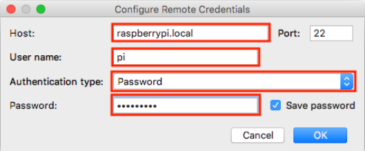

## Vzdálený vývoj

Vzdálený vývoj (remote development) znamená, že výpočetně náročné vývojové prostředí běží na běžném počítači, zatímco kompilace a spouštění programu probíhána cílovém počítači.
Tímto způsobem lze například velmi pohodlně programovat embedded hardware případně servery.
Velká výhoda je, že například jde z Windows nebo MacOS programovat aplikace pro Linux, což nemusí vždy být možné kvůli chybějícím knihovnám napřiklad i2c-dev.
Funkcionalita vzdáleného vývoje byla doprostředí CLion přidána ve verzi 2018.3.

Pro nakonfigurování vzdáleného vývoje je nutné nejprve přejít do nastaveníprostředí CLion (Preferences).
Zde ve stromu vybereme "Build, Execution, Deployment" a položku "Toolchains" viz obrazek.
Dále klikneme na tlačítko "+".

Následně vyplníme jméno toolchainu a volbu "System" přepneme na "RemoteHost" tak, jak je to zobrazeno na obrazku.
Následně klepneme na ikonu složky upoložky "Credentials" a nastavíme je podle konfigurace našeho robotu.
Pokud konfigurace Raspberry Pi nebyla měněna, lze použít hodnoty uvedené v tabulce a zobrazené na obrázku.
Na Raspberry Pi musí být povoleno SSH.

| parametr | hodnota |
| -------- | ------- |
| Host | raspberrypi.local |
| Port | 22 |
| User name | pi |
| Password | raspberry |

Po kliknutí na OK, se CLion pokusí připojit k danému Raspberry Pi a zkontroluje,zda jsou všechny potřebné programy k dispozici.
Připojování je vidět na obrazku a úspěšné připojení je vidět na dalsim obrazku.

Dalším důležitým krokem je konfigurace CMake, ta se provádí rovněž v okně Preferences tak jak je zobrazeno na obrazku.

Po kliknutí na "+" nakonfigurujeme CMake tak aby používal náš nový toolchain,tak jak je to zobrazeno na obrázku a klikneme na OK.

Po kliknutí na OK proběhne upload souborů na Raspberry Pi, po uploadu je nutné přepnout konfiguraci CMake na naši nově vytvořenou jak je zobrazenona obrazku.

Poté následuje reload konfigurace jak je zobrazeno na obrazku.

Po kliknutí na tlačítko kompilace a spuštění se náš firmware zkompiluje naRaspberry Pi a spustí se, tak jak je vidět na obrazku, kdy úspěch poznáme podle toho, že se spustitelný soubor spouští z adresáře tmp.

Vzdálený vývoj je nyní nakonfigurován