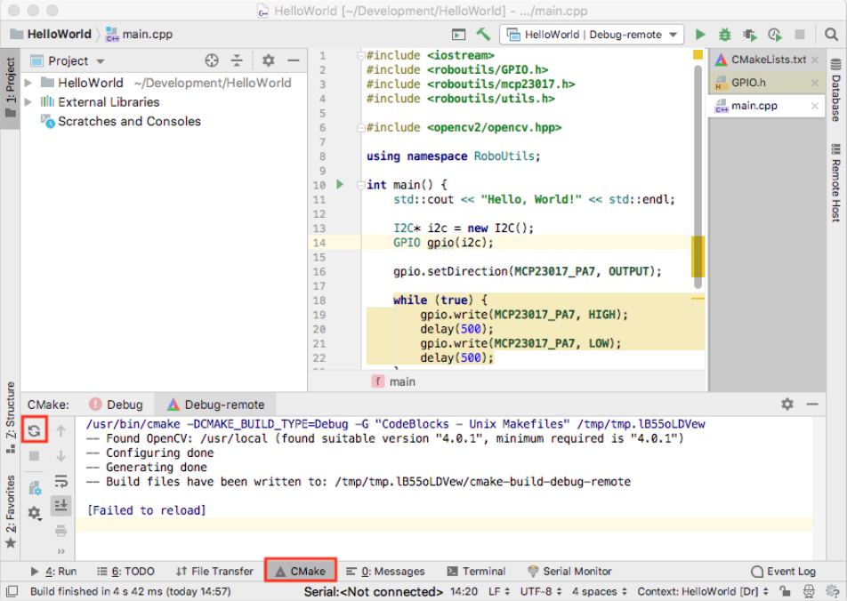

## Troubleshooting
V této kapitole bude rozebráno řešení problémů vznikajících při použití vzdáleného vývoje.

### CMake 3.12 is required. You are running version 3.7.2
Problém je ve vašem CMakeLists.txt, změňte parametr "cmake_minimum_required".

### V Raspberry Pi chybí požadované soubory
Po kliknuti na slozku projektu v levem panelu, kliknete na "Deployment", "Upload to" a vyberte Raspberry Pi.

### Ultimátní řešení problémů
Zkontrolujte, jestli v CMakeLists.txt jsou uvedeny všechny soubory, které se mají kompilovat.
Zkuste v podokně CMake provést reload, jak je zobrazeno na obrazku.
Pokud to nepomůže, přes SSH se připojte k Raspberry Pi, v /tmp smažte momentálně používanou složku pro vzdálený vývoj, restartujte CLion.

