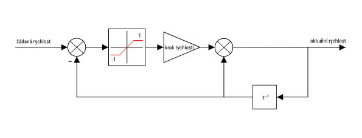

# Řízení motorů
Cvičící: Bc. Matouš Hýbl, Ing. Lukáš Kopečný Ph.D.

## Cile
* Rozpohybovat kola simulovaneho robota tak, aby bylo mozne ridit jeho pohyb pomoci kinematiky.
* Zprovoznit cteni ujete drahy jednotlivych motoru.

## Prerekvizity
* Funkční komunikace se simulátorem (ověřit pomocí zprávy `PING`)
* Funkční parsování NMEA řetězců
>

## RESET simulátoru
V tomto cvičení již budete ovládat robota v simulátoru, je tedy nutné pravidelně navracet simulátor do výchozího stavu.
Toho lze dosáhnout jak opětovným spuštěním jak simulátoru, tak vašeho programu, lze to ale řešit přímočařeji, a to tak, že při startu vašeho programu simulátoru pošlete NMEA zprávu pro reset, tedy `$RESET,*CHKSUM`.

✅ Po odeslání resetu byste měli přijmout NMEA zprávu začínající slovy `$RESET,DONE`.

## Ovladání motorů v simulátoru
Simulátor simuluje chování dvou krokových motorů, na které jsou namonotována kola uživatelsky definovaného průměru.
Motory jsou řízeny každý separátně pomocí NMEA zpráv posílaných simulátoru.

Zprávy, kterými lze řídit motory jsou následující:

| příkaz | parametr | význam |
| ------ | -------- | ------ |
| LSPEED | float rychlost levého motoru v microstepech za sekundu | nastaví rychlost levého kola na požadovanou hodnotu |
| RSPEED | float rychlost pravého motoru v microstepech za sekundu | nastaví rychlost pravého kola na požadovanou hodnotu |
| LODO | - | posílá požadavek na zjištění ujeté vzdálenosti levého motoru v microstepech od posledního zavolání tohoto příkazu, hodnota je interně ukládána jako 64b int |
| RODO | - | posílá požadavek na zjištění ujeté vzdálenosti pravého motoru v microstepech od posledního zavolání tohoto příkazu, hodnota je interně ukládána jako 64b int |

Zde stojí za zmínku podivné nastavování rychlosti v microstepech za sekundu.
Jak jistě víte krokový motor se s každým impulzem na vinutích posunuje o 1 krok (step).

✅ Počet kroků na otáčku je vlastností daného krokového motoru.

Tyto kroky je ale možné interpolovat, každý krok se tedy rozdělí na X tzv. mikrokroků (microstepů).

✅ Mikrostepování a množství jeho úrovní je vlastností použitého driveru motorů.
   
✅ Z datasheetu motoru byste zjistili, že rozměr kroku je 1.8°, na plnou otáčku tedy připadá kolik kroků?

    
Odpověď

    360 / 1.8 = 200

   
✅ Zadaný driver motorů má interpoluje krok do 32 mikrokroků, kolik mikrokroků připadá na celou otáčku?

    
Odpověď

    200 * 32 = 6400

  
Pokud řídíme reálné fyzikální systémy je vhodné programova pomocí reálných fyzikálních jednotek a vždy to dodržovat, nestane se nám tak, že nebudeme vědět jaký rozměr má nějaká proměnná.

Zvolme si tedy, že požadovaným vstupem do našeho softwareového driveru motorů bude úhlová rychlost zadaná v otáčkách za sekundu a tuto rychlost máme převést na microstepy za sekundu. Jak to provedeme?

    
Odpověď

    float speedInMicrosteps = targetSpeed * microstepsPerRevolution

  

### Posílaní řídicích zpráv
Nezbytnou teorii máme za sebou, pusťme se tedy do samotného programování.
Z tabulky výše víme, že příkaz pro nastavení rychlosti levého motoru je `LSPEED`.
Pošleme tedy tento příkaz simulátoru s nějakou malou rychlostí, třeba 0.05 otáčky za sekundu.

✅ Pokud nám vše správně funguje, měl by se robot v simulátoru začít pomalu otáčet.

Motor se po asi 1 s otáčení zastaví, toto je bezpečnostní funkce, která je implementována v našich reálných driverech. 
V případě softwareové chyby, kdy by spadl řídicí program, by se totiž robot mohl nekontrolovatelně rozjet. 
Je tedy nutné řídicí příkazy posílat pořád.

Nyní zkusme nastavit rychlost motoru na nějakou velkou rychlost, třeba 1 otáčku za sekundu. Co se stane?

    
Odpověď

    Robot stojí na místě. Je to proto, že tímto simulujeme reálnou vlastnost mechanických systémů a zvláště krokových motorů, které mají nízký kroutící moment ve vysokých otáčkách, ale vysoký v nízkých.
    Tento problém je nutné řešit takzvaným generátorem ramp, který zajistí, že zrychlování/zpomalování motoru bude probíhat postupně po definovaných přírustcích rychlosti.

### Generování ramp
Jak jsme si ukázali v minulé části, s krokovým motorem nelze zrychlovat s neomezenou akcelerací, je teda nutné zrychlovat postupně s konstantním malým zrychlením.

Implementací tohoto postupuje takzvané generování ramp, které v průběhu času generuje z požadované rychlosti a diference rychlosti v každém kroku momentální rychlost motoru. V tomto cvičení budeme implementovat jednoduchý generátor trapézoidních ramp.

✅ Algoritmus takového generátoru je prostý. V každém kroku k momentální rychlosti motoru přičteme požadovanou diferenci rychlosti se stejným znaménkem jako má rozdíl `požadovaná rychlost - momentální rychlost`.

Pro implementaci lze jako návod použít následující modelovací schéma.

Toto opakujeme ve smyčce s frekvencí která odpovídá tomu jak rychle chceme provádět zrychlování na požadovanou hodnotu.

Generátor rampy, který běží periodicky pořád, nám efektivně řeší problém s opakováním řídicích zpráv pro motory, stačí periodicky získávat novou hodnotu rychlosti z generátoru ramp a tu posílat simulátoru.

✅ Pro programování separátních smyček pro generování ramp lze s výhodou použít separátní vlákno, je ale nutné pamatovat na správnou synchronizaci přístupu ke sdíleným prostředkům - není například možné, aby dvě vlákna současně posílala příkazy simulátoru.

✅ Maximální rychlost motorů je zasaturována v simulátoru, pokuste se najít maximální rychlost, které jste schopni dosáhnout.

## Čtení ujeté vzdálenosti
Pro lokalizaci robota v prostředí lze využít výpočtu odometrie z ujeté vzdálenosti obou kol, to bude předmětem dalších cvičení, je ale vhodné si to již teď připravit.
Čtení ujeté vzdálenost je v simulátoru implementováno pomocí příkazů `LODO` a `RODO`. Tyto příkazy spůsobí, že nám simulátor pošle ujetou vzdálenost v mikrostepech a sám si vnitřní hodnotu ujeté vzdálenosti vynuluje.

✅ Vyzkoušejte si čtení ujeté vzdálenosti jednotlivých a jejich přepočet na metry.

✅ Vyzkoušejte si, že se hodnota ujeté vzdálenosti opravdu nuluje.

## Očekávané výstupy práce v tomto cvičení

✅ Jste schopni ovládat oba motory simulovaného robota v plném rozsahu rychlostí.

✅ Máte naimplementováno generování ramp pro oba motory.

✅ Jste schopni ze simulátoru získávat data o ujeté vzdálenosti pro oba motory.
