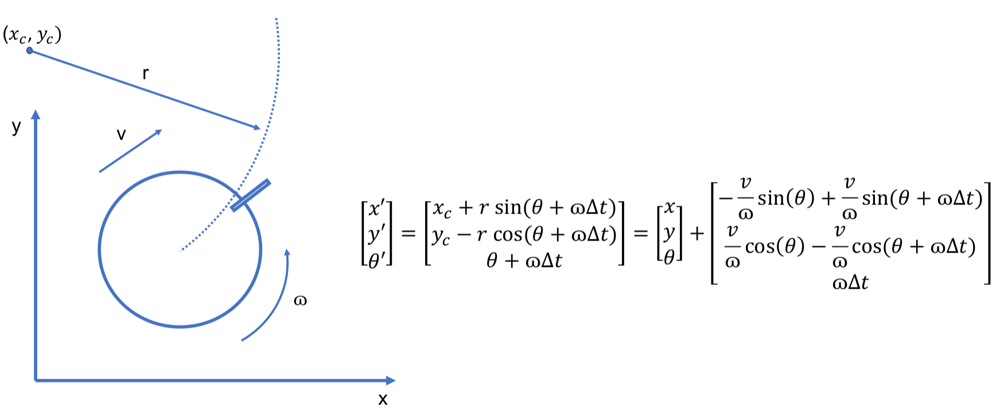

# Telemetrie a vizualizace

Cvičící: Ing. Adam Ligocki, Ph.D., Ing. Tomáš Horeličan

Před cvičením si zopakujte návod [ROS](../chap_1_software/text/ros.md) z kapitoly [Softwarové vybavení](../chap_1_software/text/intro.html)

# Tvorba vlastního ROS nodu (cca 1h)

V první fázi cvičení si vytvoříme svůj vlastní ROS workspace (složka, která obsahuje ROS package) a ROS package (CMakeList projekt, který pracuje s ROS knihovnama).

Přistup je dvojí. Je možné použít příkazy z příkazové řádky (catkin_pkg_create, catkin_make, ...)

Oficiální tutoriály pro práci s CLI:

 - [ROS File Systém](http://wiki.ros.org/ROS/Tutorials/NavigatingTheFilesystem)
 - [Tvorba balíčku](http://wiki.ros.org/ROS/Tutorials/CreatingPackage)
 - [Kompilace balíčku](http://wiki.ros.org/ROS/Tutorials/BuildingPackages)
 - [Vysvětlení ROS nodu](http://wiki.ros.org/ROS/Tutorials/UnderstandingNodes)
 - [Ostatní tutoriálny](http://wiki.ros.org/ROS/Tutorials)

My si však dnes vytvoříme balíčky ručně a při tom si vysvětlíme jednotlivé kroky, které první způsob automatizuje.

V prvním kroku si vytvoříme na libovolném místě ve file systému složku `ros_ws`. Jméno složky však může být libovolné. Je jen dobré zachovávat best practice postupy. Uvnitř právě vytvořené složky `ros_ws` si vyrobíme složku `src`. Tímto jsme vytořili ROS workspace.

Nyní se přesuneme do podsložky `ros_ws/src/`. Nacházíme se v místě, kde se umisťují tzv. ROS balíčky (package), tedy CMake projekty, které pracují s ROS knihovnou. V našem případě si vytvoříme jeden balíček tak, že vytvoříme složku `my_first_ros_project`. Uvnitř této složky pak vytvoříme složky `include` a `src`, a soubory `package.xml` a `CMakeLists.txt`. Ve složce `src` pak soubor `main.cpp` a ve složce `include` soubor `RosExampleClass.h`.

Struktura celého workspacu bude tedy vypadat následovně.

```
ros_ws/
└── src/
    └── my_first_ros_package/
        ├── CMakeLists.txt
        ├── include/
        │   └── RosExampleClass.h
        ├── package.xml
        └── src/
            └── main.cpp
``` 

Nejprvo si napíšeme obsah `CMakeLists.txt` souboru. Ten bude následovný.

```cmake
cmake_minimum_required(VERSION 3.10.0)
project(my_first_ros_project)

## Find catkin and any catkin packages (ros client libraries)
find_package(catkin REQUIRED COMPONENTS roscpp std_msgs)

## Declare a catkin package (internal catkin macro, process package.xml)
catkin_package()

## Add our include directory and include directories with ROS headers
include_directories(include ${catkin_INCLUDE_DIRS})

add_executable(cpp_talker src/main.cpp)
target_link_libraries(cpp_talker ${catkin_LIBRARIES})
```

Dále pak soubor `package.xml`

```xml
<?xml version="1.0"?>
<package format="2">
    <name>my_first_ros_project</name>
    <version>0.1.0</version>
    <description>Example ros c++ publisher project</description>

    <maintainer email="my@email.todo">adash</maintainer>

    <license>TODO</license>
    <buildtool_depend>catkin</buildtool_depend>
    <build_depend>roscpp</build_depend>
    <build_export_depend>roscpp</build_export_depend>
    <exec_depend>roscpp</exec_depend>
</package>
```

A nyní si niž můžeme projekt otevřít jako CMake projekt v CLionu a napsat kód v `main.cpp`. Pozor, je potřeba otevřít CLion v termiále, kde máte načtené prostředí ROSu (source /opt/ros/noetic/setup.bash).

```cpp
#include <ros/ros.h>
#include "RosExampleClass.h"

int main(int argc, char* argv[]) {
    ros::init(argc, argv, "cpp_ros_example");       // connects node with ros core
    auto node = ros::NodeHandle();                            // API for ros functionality

    auto example_class = RosExampleClass(node, "my_topic", 1.0);

    while (ros::ok()) {     // main loop
        // your main loop
        ros::spinOnce();    // allows publishers, timers and subscribers to do their job
    }

    // ros::spin(); blocking alternative of while loop above
    return 0;
}
```

Vidíte, že v main includujeme `RosExampleClass.h` a poté vytváříme její instanci. Pojďme tedy tuto třídu vytvořit ve složce `include/`

```cpp
#pragma once

#include <iostream>
#include <ros/ros.h>
#include <std_msgs/Float32.h>

class RosExampleClass {

public:
    RosExampleClass(ros::NodeHandle& node, const std::string& topic, const float freq) : node_{node} {
        publisher_ = node.advertise<std_msgs::Float32>(topic, 0);
        subscriber_ = node.subscribe(topic, 0, &RosExampleClass::subscriber_callback, this);
        timer_ = node.createTimer(freq, &RosExampleClass::timer_callback, this);
        start_time_ = ros::Time::now();
    }

private:

    void timer_callback(const ros::TimerEvent& event) const {
        std::cout << "Timer callback called" << std::endl;
        auto uptime = (ros::Time::now() - start_time_).toSec();
        publish_message(uptime);
    }

    void subscriber_callback(const std_msgs::Float32 msg) const {
        std::cout << "Just received: " << msg << std::endl;
    }

    void publish_message(float value_to_publish) const {
        std_msgs::Float32 msg;
        msg.data = value_to_publish;
        publisher_.publish(msg);
        std::cout << "Just send: " << msg.data << std::endl;
    }

    ros::NodeHandle &node_;
    ros::Publisher publisher_;
    ros::Subscriber subscriber_;
    ros::Timer timer_;
    ros::Time start_time_;
};
```

Nýní můžeme v CLionu projekt zkompilovat a spustit.

Alternativně je možné přejít do kořehe workspacu a zavolat "rosrun <jmeno_balicku> <jmeno_binarky>"

```
catkin_make
source devel/setup.bash
rosrun my_first_ros_project cpp_ros_example 
```

Čímž jsme řekli `catkin_make` - zkompiluj celý ROS workspace, `source devel/setup.bash` - načti právě zkompilované balíčky a `rosrun my_first_ros_project cpp_ros_example` - zapni program `cpp_ros_example` z balíčku `my_first_ros_project`.


Dále si pak můžeme vypsat si zprávy přímo v terminále.

```
rostopic echo <nazev_topicku>
```

Podívat na komunikaci pomocí programu rqt_graph.

```
rqt_graph
```

Či dokonce vykreslit si časový průběh v programu rqt_plot.

```
rqt_plot
```


Ukázka odeslání float hodnoty skrze ros::Publisher
```cpp

ros::Publisher float_publisher;
float_publisher = node->advertise<std_msgs::Float32>("some_topic", 0);
...
float_publisher.publish(float_value);
```

Tímto spůsobem je možné si napšíklad vizualizovat požadované a skutečné rychlosti kol (ověřit si strmost rampy), vykreslit si do grafu výstupy snímačů a přepočet na pozici vůči čáře, či si například vizualizovat odezvy jednotlivých složek PID regulátoru.


# Integrace ROS klientské knihovny do BPC-PRP projektu (cca 30 min)

Nyní se pokuste transformovat Váš BPC-PRP projekt tak, aby byl ROS Nodem, podle výše uvedeného návodu a aby Váš projekt byl chopen publishovat ROS zprávy.

POZOR! - Zvažte, zda se vydáte cesout blokujicího `ros::spin()`, v tom případě si zablokujete Vaší main smyčku, nebo se vydáte cestou while smyčky s `ros::spinOnce()`. V tom případě se ale publishery, subscribery a timery přijmou/odešlou zprávu, nebo zavolají timer callback pouze, když se provede řádek `ros::spinOnce()`.

```
while (ros::ok()) {     // main loop
    /* your code */
    ros::spinOnce();    // allows publishers, timers and subscribers to do their job
}
```

# Vizualizace v RViz (cca 1h)

Nyní se podíváme, jak vytvářet vizualizace pro RViz.

Neprve si nastudujte oficiální dokumentaci k [vizualizaci v RViz](http://wiki.ros.org/rviz), případně tutoriál o tzv. [markerům](http://wiki.ros.org/rviz/DisplayTypes/Marker).

Jedná se o zprávy z ROS knihovny "visualization_msgs". Tyto zprávy umoňují vizualizaci geometrických těles, šipek, úseček, polyúseček, mračna bodů, textu, nebo mesh gridů.

My si nyní napíšeme třídu, která bude vizualizovat krychli, jenž bude plavat 3D prostředím a vedle ní budem vypisovat její aktuální polohu.

```cpp
#pragma once
#include <iostream>
#include <ros/ros.h>
#include <visualization_msgs/MarkerArray.h>

#define format std::fixed << std::setw(5) << std::showpos << std::setprecision(2)

class RvizExampleClass {

    class Pose {
    public:
        Pose(float x, float y, float z) : x_{x}, y_{y}, z_{z} {}
        float x() const {return x_;}
        float y() const {return y_;}
        float z() const {return z_;}
    private:
        const float x_, y_, z_;
    };

public:

    RvizExampleClass(ros::NodeHandle& node, const std::string& topic, float freq) : node_{node} {
        timer_ = node.createTimer(freq, &RvizExampleClass::timer_callback, this);
        markers_publisher_ = node.advertise<visualization_msgs::MarkerArray>(topic, 0);
    }

private:

    void timer_callback(const ros::TimerEvent& event) {
        auto time = ros::Time::now().toSec();
        auto pose = Pose(sin(time), cos(time), 0.5 * sin(time*3));

        visualization_msgs::MarkerArray msg;
        msg.markers.push_back(make_cube_marker(pose));
        msg.markers.push_back(make_text_marker(pose));
        markers_publisher_.publish(msg);
    }

    visualization_msgs::Marker make_cube_marker(const Pose& pose) {
        visualization_msgs::Marker cube;

        // Coordination system
        cube.header.frame_id = "origin";

        // Timestamp
        cube.header.stamp = ros::Time();

        // Marker Type
        cube.type = visualization_msgs::Marker::CUBE;
        cube.action = visualization_msgs::Marker::ADD;
        cube.id = 0;

        // Position
        cube.pose.position.x = pose.x();
        cube.pose.position.y = pose.y();
        cube.pose.position.z = pose.z();

        // Rotation (quaternion, see https://quaternions.online/)
        cube.pose.orientation.x = 0.0;
        cube.pose.orientation.y = 0.0;
        cube.pose.orientation.z = 0.0;
        cube.pose.orientation.w = 1.0;

        // Size
        cube.scale.x = cube.scale.y = cube.scale.z = 0.1;

        // Color
        cube.color.a = 1.0; // alpha - visibility
        cube.color.r = 0.0;
        cube.color.g = 1.0;
        cube.color.b = 0.0;

        return cube;
    }

    visualization_msgs::Marker make_text_marker(const Pose& pose) {
        visualization_msgs::Marker text;

        // Coordination system
        text.header.frame_id = "origin";

        // Timestamp
        text.header.stamp = ros::Time();

        // Marker Type
        text.type = visualization_msgs::Marker::TEXT_VIEW_FACING;
        text.action = visualization_msgs::Marker::ADD;
        text.id = 1;

        // Position
        text.pose.position.x = pose.x();
        text.pose.position.y = pose.y();
        text.pose.position.z = pose.z() + 0.2;

        // Size
        text.scale.z = 0.1;

        // Text
        std::stringstream stream;
        stream << "* Cool Cube *" << std::endl
               << "  x: " << format << pose.x() << std::endl
               << "  y: " << format << pose.y() << std::endl
               << "  z: " << format << pose.z();
        text.text = stream.str();

        // Color
        text.color.a = 1.0; // alpha - visibility
        text.color.r = 1.0;
        text.color.g = 1.0;
        text.color.b = 0.0;
        return text;
    }

    ros::NodeHandle& node_;
    ros::Timer timer_;
    ros::Publisher markers_publisher_;
};
```

v souboru main.cpp pak

``` cpp
#include <ros/ros.h>
#include "RvizExampleClass.h"

int main(int argc, char* argv[]) {

    ros::init(argc, argv, "cool_node_name");
    auto node = ros::NodeHandle();
    auto rviz_visualizer = RvizExampleClass(node, "rviz_topic", 30.0);
    
    ros::spin();
    return 0;
}
```


Topic na kterém publikujete zprávu si zobrazte v RVizu.

✅  Inspirujte se touto třídou a vytvořte v rámci Vašeho BPC-PRP projektu modul, který bude vypisovat nad robotem jeho aktuální rychlost kol a hodnotu ze všech senzorů. 

✅  Publikujte do Vámi nazvaného topicu skalár vzdálenosti robota od čáry. Tuto hodnotu vizualizujte v rqt_plot.

✅  Vytvořte krátké video ve kterém ukážete, dvě výše uvedené funkcionality. Video nahrejte na git do složky s odevzdáními.

# Optional: visualizace plánované trajektorie (cca 30min)

Ukážeme si další možný příklad užitečné vizualizace v RVizu. Na základě znalosti aktuální rychlosti kol si dokážeme vypočítat lineární a úhlovou rychlost robota.


Ze znalosti lineární a úhlové rychlosti pak dokážeme vypočítat trajektorii, kterou robot projede, pokud zachová konstantní rychlosti.



Příklad ukazuje funkci, která na vstupu přijmá jako argumenty právě dopřednou a úhlovou rychlost v SI jednotkách (m/s a rad/s) a na základě této informace vykreslí v RVizu budoucí trajektorii.

``` cpp
void draw_predicted_trajectory(float lin_vel, float ang_vel) {
    
    // Create message instance
    auto msg = visualization_msgs::Marker{};
    
    // Define frame and timestamp 
    msg.header.frame_id = "robot"; // frame "robot" means, that (0,0) point is in the origin of your robot
    msg.header.stamp = ros::Time().now();
    msg.id = 0;

    // Define marker type
    msg.type = visualization_msgs::Marker::LINE_STRIP; // lines that interconnect set of points
    msg.action = visualization_msgs::Marker::ADD;

    // Define 
    msg.pose.orientation.w = 1.0; // avoid invalid quaternion
    msg.scale.x = 0.005; // line strip width in meters

    // Purple color
    msg.color.b = 1.0;
    msg.color.r = 1.0;
    msg.color.a = 1.0;

    // First point (robot origin)
    geometry_msgs::Point previous_p;
    previous_p.x = 0.0;
    previous_p.y = 0.0;
    previous_p.z = 0.0;
    
    float theta = 0.0f;
    float dt = 0.1;     // trajectory approximation step
    for (size_t i = 0; i < 50; ++i){    // 0.1s * 50 = 5s of prediction
        geometry_msgs::Point p = previous_p;
        
        // Arc trajectory
        if (ang_vel != 0) {
            float radius = lin_vel / ang_vel;
            p.x += -radius * sin(theta) + radius * sin(theta + ang_vel*dt); // see the arc trajectory model
            p.y +=  radius * cos(theta) - radius * cos(theta + ang_vel*dt);
            theta += ang_vel*dt;
        } 
        // Directly forward
        else {
            p.x = previous_p.x + lin_vel * dt;
        }
        
        // Add trajectory point to message
        msg.points.push_back(p); 
        previous_p = p;
    }
    
    // Send trajectory to RViz
    trajectory_publisher_.publish(msg); 
}
```

Příklad možné výsledné implementace


