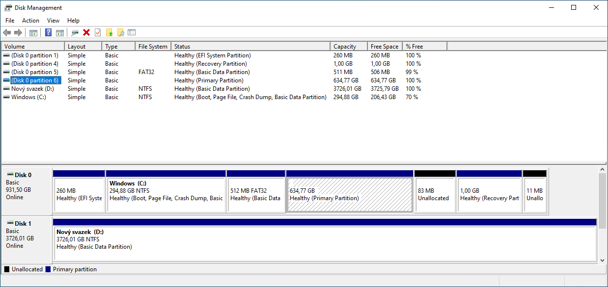
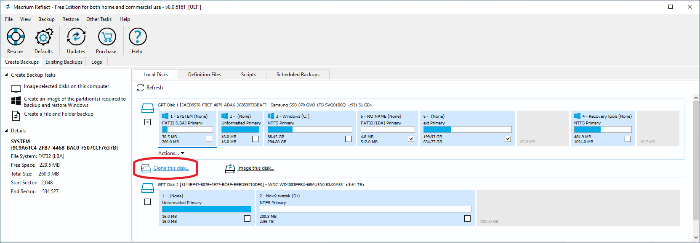
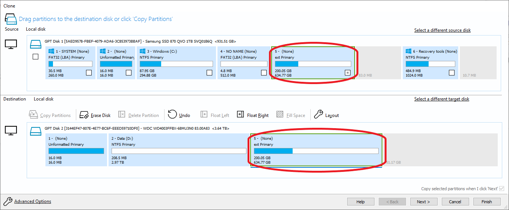
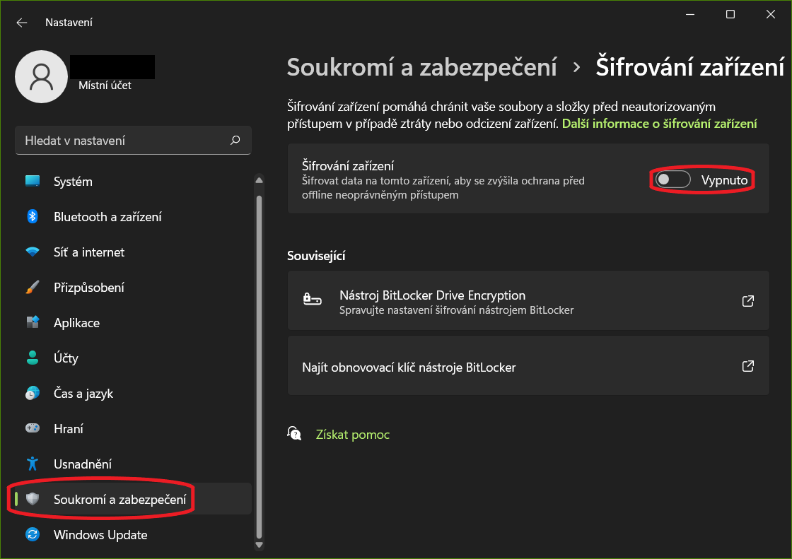
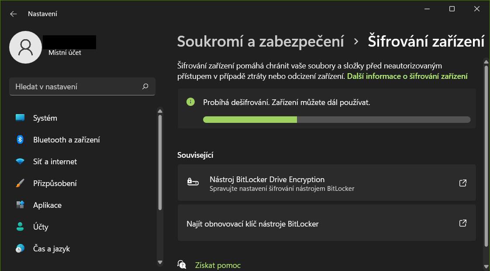
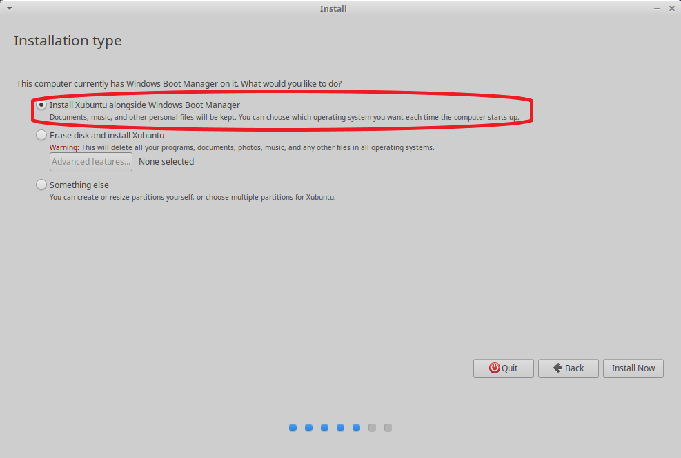
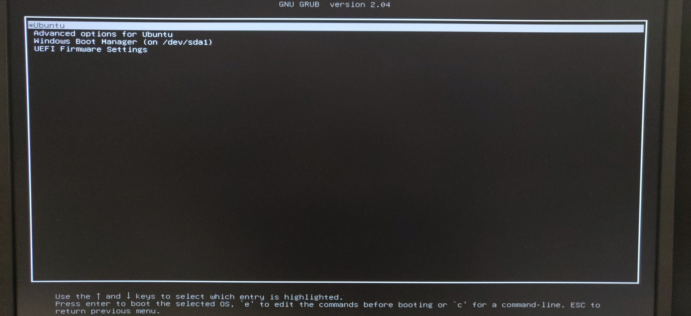

# Instalace Linuxu vedle Windows

Tuto metodu zvolte, pokud chcete mít linux rychlý, nebo máte postarší stroj.

## Tvorba instalačního média

## Rozdělení disku / vytvoření prostoru pro instalaci

Nejprve je vhodné nachystat prostor na disku, kde bude Linux nainstalován. To udeláte ve svém Windowsu pomocí utility `Disk Management`. Stiskněte `Start` a do vyhledávaní napíšte `diskmgmt.msc` a spusťte.

Otevře se vám nové okno s managerem kde uvidíte všechny dostupné disky:

Nejpohodlnejší je samozřejmě mít druhý systém nainstalován na samostatném disku (viz. obrázek dolu, kde je označen disk s nainstalovaným Linuxem).

Mnohokrát ovšem taková možnost není a musíte si oba systémy rozdelit do jednoho disku. Např. když máte jen jedno rychlé SSD, ze kterého chcete oba systémy bootovat. Pro to je potřeba uvolnit (odalokovat) místo z některého oddílu na disku.

> **POZOR!** - V Disk Manageru uvidíte kromě základních oddílů, ke kterým máte jako uživatel prístup (např. C:, D:, atd.), také skryté oddíly které Windows interně využíva (obvykle bez označení písmenem). Nesnažte se zasahovat do těchto oddílů, jinak můžete poškodit svůj systém.

    
Záloha

Pokud chcete mít jistotu, že o svoje dáta nepřijdete můžete si celý disk nebo jeho jednotlivé oddíly zálohovat na externí disk. Můžete použít program [Macrium Refect](https://www.macrium.com/reflectfree) pro klonování disků. Po zpuštění programu vyberete disk, který chcete klonovat.

Následně vyberete disk, na který chcete klon převézt a zvolíte které oddíly se mají klonovat. Tento proces může v závislosti na velikosti klonovaného oddílu trvat celkem dlouho.

Klikněte na zvolený oddíl (ideálně ten, na kterém máte nejvíce místa) a vyberte možnost "zmenšit".

Vyberte kolik míste chcete uvolnit (např. 100GB).

V disk manageru nyní uvidíte váš nově uvolněný prostor a můžete přejít k instalaci Linuxu.

Pokud máte ve Windowsu zapnuté šifrování disku BitLockerem (např. u Windows 11 je to default), budete ho muset vypnout. Instalace Linuxu není možná pokud je disk šifrován. Existují způsoby jak zachovat šifrování i pro dual boot ale nejjednodušší je ho pro naše účely úplně vypnout.

    
Windows BitLocker

Ve Windows 11 najdete nastavení v části `Soukromí a Zabezpečení > Šifrování zařízení`. Pro zálohovaní obnovovacího klíče klikněte na `Nástroj BitLocker Drive Encryption` a vyberte možnost zálohovat. Můžete také postupovat podle návodu [zde](https://help.ubuntu.com/wip/bitlocker/). Po vypnutí nastavení zaháji Windows dešifrování disku, tento proces může nejakou chvíli trvat.

Po dokončení dešifrace restartujte systém.

## Zahájení Instalace Linuxu

Vložte nachystané instalační USB a restartujte systém. Nezapomeňte si v BIOSu přepnout nastavení na boot z USB pokud máte nastavené prioritně bootování z disku s Windowsem. Zvolte jazyk anglicky a vyberte možnost instalovat.

Zvolte normální instalaci a dále můžete zaškrtnout možnost stahování updatů počas instalace a instalaci driverů od třetích strán, a nebo je vynechat a doinstalovat vše potřebné později.

Následně, pokud instalatér detekuje na vašem disku bootovací oddíl pro Windows, můžete zvolit možnost automatické instalace vedle systému Windows. Dále už proběhne samotná instalace do uvolněného prostoru. Pokud tuto možnost neuvidíte budete muset zvolit možnost `Something else` a manuálně vybrat kam se má Linux nainstalovat.

    
Manuálni Instalace

V seznamu najděte položku s volným prostorem. Její velokost musí odpovídat tomu kolik místa jste si uvolnili v předchozích krocích. V tomto příkladu jsou obrázky z jiného počítače, proto je velikost jiná. Stiskněte plus pro vytvoření nového oddílu.

Vyberte maximální dostupnou velikost a zbytek podle obrázku dolu:

Poté uvidíte nově vytvořený oddíl v seznamu.

> **POZOR!** - V spodní části můžete zvolit kam se na nainstalovat bootovací oddíl pro Linux. Tady nechejte buď celý disk (položku s názvm celého disku kde instalujete Linux) a nebo právě nově vytvořený oddíl. Nikdy nevybírejte žádnej jinej oddíl, který je na disku.

Pak už jen vyberete časové pásmo, a vytvoříte si username a heslo k účtu.

Instrukce pro instalaci Linuxu najdete také [zde](https://itsfoss.com/dual-boot-ubuntu-windows-bitlocker/).

### Výsledek

Po dokončení instalace a restartu uvidíte obrazovku boot manageru (`GRUB`), kde můžete vždy volit jestli chcete zpustit Linux nebo Windows. 

V BIOSu můžete také vidět více možnosti pro bootování systému. Boot manager pro Linux, který zároveň detekuje i všechny ostatní nainstalované systémy, a boot manager pro Windows, který uvidí vždy jen svůj vlastní systém Windows. Je proto nejlepší ponechat jako prioritní manager Linuxu, protože z nej můžete jednoduše bootovat i do svého Windowsu.

## Odstranění Linuxu

