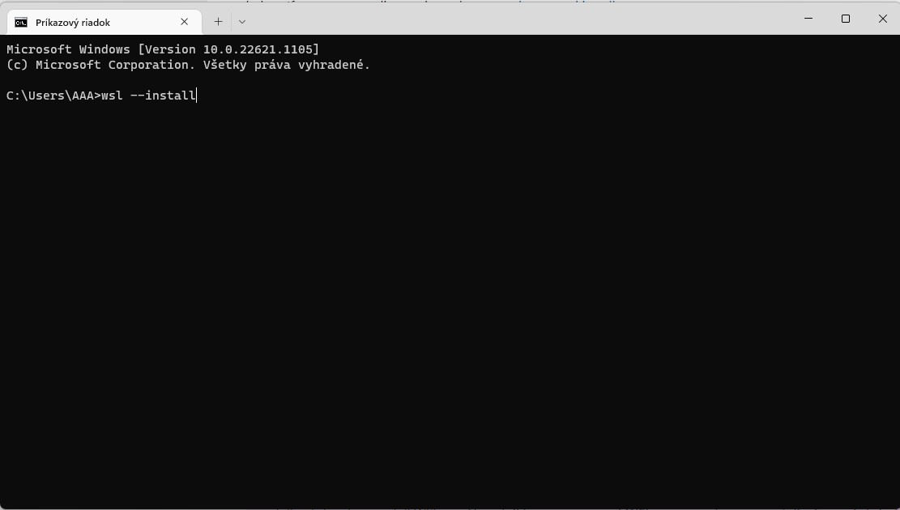
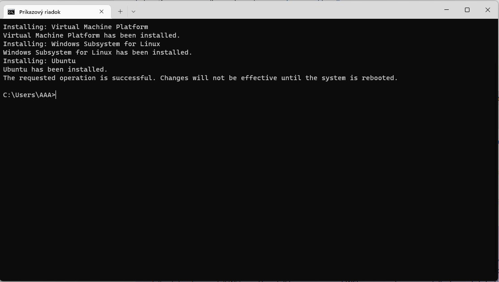
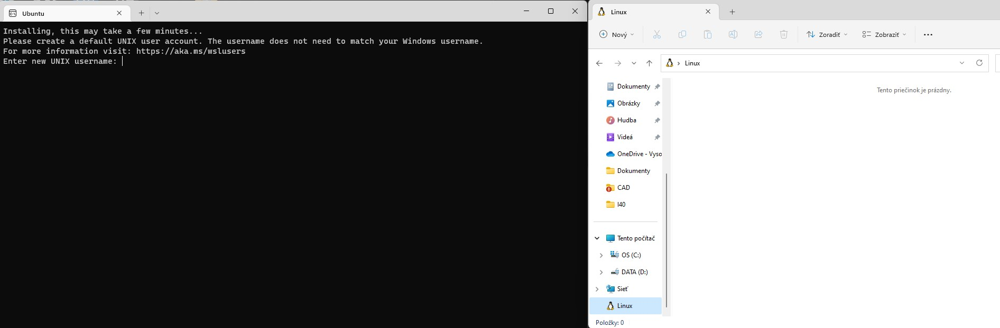
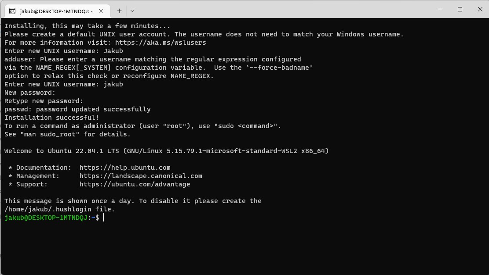
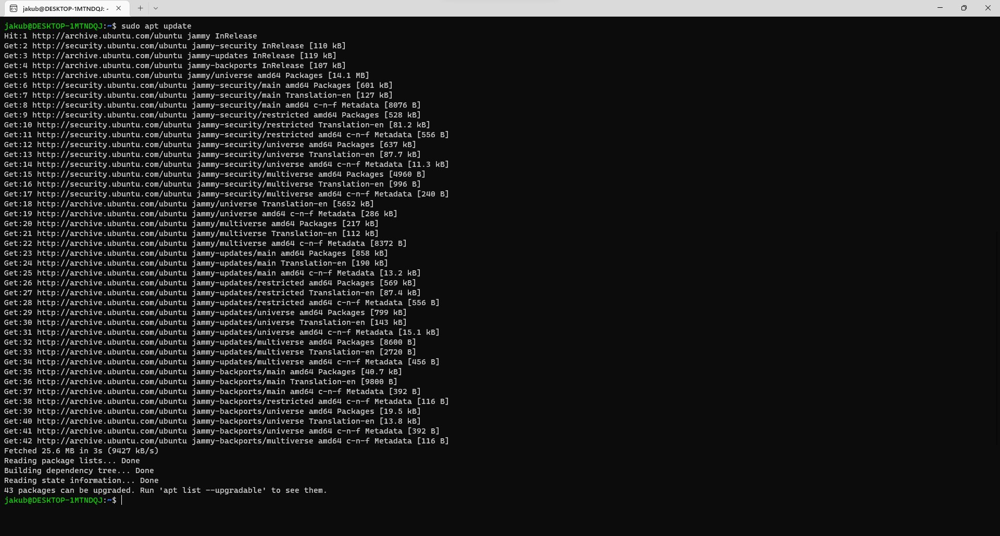
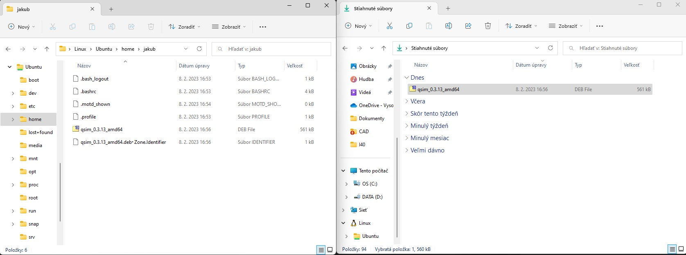
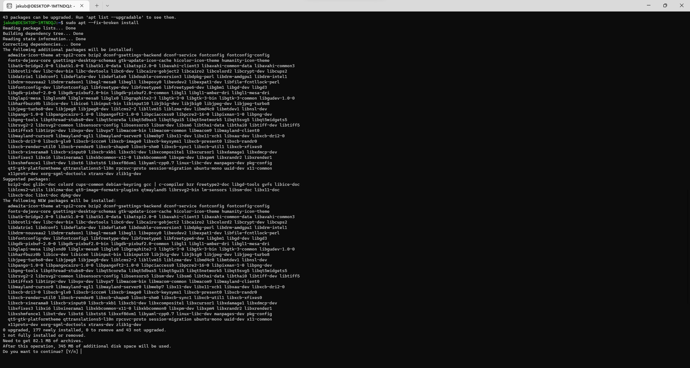
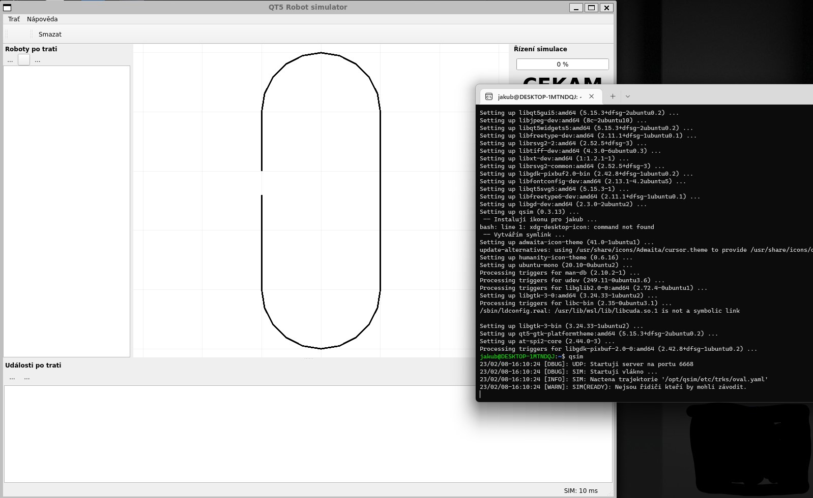

### Instalace Linuxu Windows Services for Linux

Tuto metodu zvolte, pokud chcete mít linux běžící současně s windows a nemáte dostatečné prostředky pro plnohodnotnou instalaci do virtuálního stroje.

WSL je jen částečná virtualizace, vytvořený stroj neběží v sandboxu, využívá jádra windows a proto je oproti standardn virtualizaci rychlejší.

**POZOR** WSL není plnohodnotným operačním systémem, chybí grafické rozhraní a spousta věcí je emulována pomocí eindows. Pod WSL nedoporučujeme spouštět 
ROS, i kdyby se jej nainstalovat podařilo, budete čelit různým nepředvídatelným problémům.

**POZOR** Na některých (zejména notebookových) procesorech není integrována podpora pro virtualizaci (takové notebooky bývají levnější). Na počítači 
který nemá tuto podporu bude jakákoliv virtualizace velmi pomalá a jedinou schůdnou variantou pro Vás bude multiboot.

Celý nainstalovaný operační systém vám na disku zabere cca 3 GB místa

#### Instalace podpory emulace

Podporu pro virtuální stroj nainstalujete pomocí:

```shell
wsl --install
```



Následně se Vám začne instalovat podpora pro virtualizaci



Po skončení potřebuje restartovat počítač. 

Všimněte si, že v průzkumníku se vám v levém stromě adresářů vlevo objeví nová položka "Linux", která je nyní prázdná.

Po restartu se Vám **automaticky** spustí pokračování instalace (doinstalování operačního systému), je potřeba počkat na následující okénko.



Zde je potřeba zadat nové uživatelské jméno a heslo (heslo se při psaní nezobrazuje kvůli bezpečnosti, ani hvězdičky) a nechat instalaci dokončit

Takto nějak vypadá úspěšně nainstalované WSL s aktuálním Ubuntu 22.04.



Následně je potřeba aktualizovat databázi balíčků z internetu (nutný internet)

```shell
sudo apt update
```



A aktualizovat balíčky, které mají nějaké aktualizace

```shell
sudo apt upgrade
```

Po aktualizaci máme systém připravený pro instalaci simulátorů.

Nyní stáhneme nejnovější potřebné balíčky simulátorů z [SIM](https://sw.srob.fekt.vut.cz/sim) a [NMEA](https://sw.srob.fekt.vut.cz/nmea)

Tyto stažené balíčky je nutné nejprve překopírovat do "virtuálního" stroje dle obrázku. tj ze "Stažené" do "Linux/Ubontu/home/<jmeno>/"



A následně nainstalovat (všechny závislosti se vyřeší a doinstalují samy z internetu):

```shell
sudo apt install ./qsim-xxxx.deb ./sim-demo-xxxx.deb ./sim_xxxx.deb ./nmea-xxxxx.deb
```

Při instalaci se semtam objeví nějaká chyba. Spoustu chyb pomůže vyřešit příkaz:

```shell
sudo apt --fix-broken install
```



Pokud máte vše instalováno, je možné spustit dva terminály (v menu windows hledat "Ubuntu" - spustí se druhý terminál) a v jednom spustit qsim a **poté** v druhém spustit sim-demo:

```shell
qsim
```

```shell
sim-demo
```

měla by se objevit simulace robota, která sleduje čáru.



Máte hotový linux, na kterém běží soutěžní simulátor