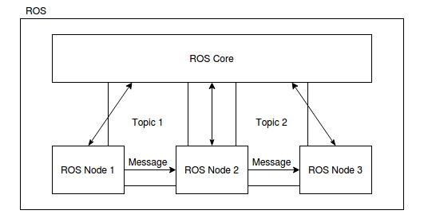
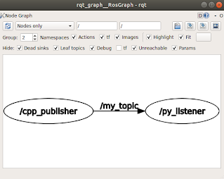

# Robotic Operating System 2

Název "Robot Operating System" poněkud klame svým zněním. Nejedná se o samostaný operační sýstém, nýbrž spíše o middle-ware, tedy softwarový nástroj (knihovnu), který pomáha propojit dílčí programy do komplexnejšího celku. V praxi si to můžeme představit tak, že máme jednoduchou aplikaci pro robotu jezdícího po čáre, kterou realizujeme pomocí 3 navzájem spolupracujících programů (příklad funguje jako ilustrační; takový robot samozřejmě můžeme naprogramovat pomocí jednoho programu; ilustrujeme tím ale komplexnější problém). První program vyčítá data ze snímače a provádí jednoduchou filtraci dat. Druhý program je mozkem celého řešení a rozhoduje o pohybu robotu. Třetí program pak přijímá řídicí pokyny a na jejich základě ovládá motory.


Obr: Schéma fungování pomyslého line-tracking robotu na platformě Rasperry Pi s použitím ROSu.

V případě absence ROSu bychom museli vymyslet způsob jak spolu budou tyto tři programy komunikovat. Mohli bychom sdílet paměť, pipovat, posílat si IP zprávy, používat DBus, etc. Všechny tyto techniky fungují, ale vyžadují určitý programátorský um. My se těmito nízkouúrovňovými problémy nechceme zabývat a proto použijeme ROS.

V praxi si pak můžeme říct, že ROS komunikuje mezi procesy právě pomocí posílání UDP paketů. To umožňuje také komunikovat procesům, které běží na různých počítačích. Tomu říkáme distribuovaný systém.

Základ ROSu je postaven na 3 stavebních kamenech.

 - ROS Node
 - ROS Topic
 - ROS Message

ROS Node - Nodem je myšlený každý program do kterého přídáme klientskou knihovnu ROSu. Naučíme tedy program používat funkce ROSu. ROS Node je pak schopen "automaticky" objevit další instance (programy), které jsou na stejné síťi spuštěny a navázat s nimi komunikaci.

ROS Topic - Doména, ve které se posílá specifický okruh ROS Messagů.

ROS Message - Jedna instance odeslané zprávy. V rámci ROSu je možné posílat jenom zprávy, které jsou striktně zadefinovány a mají svůj jasně daný formát. Často obsahují také časovou značku, kdy byly odeslány.

Dále si zadefinujme dva typy postavení ROS Nodů při komunikaci.

Subscriber - ROS Node, který přijímá všechny zprávy v rámci daného ROS Topicu.

Publisher - ROS Node, který vytváří a odesíla zprávy v rámci daného ROS Topicu.

Náš robot-sledující-čáru příklad si pak můžem ilustrovat takto:




Napíšeme zmíněné 3 programy. Jeden pro čtení dat ze snímače, druhý pro rozhodování jak se pohybovat a třetí pro ovládání motorů. První program (Node) vystaví svůj topic "SensorData" jako publisher. Druhý se přihlásí k odebírání zpráv jako subscriber v témuž topicu. V tuto chvíli dojde k navázání spojení a všechny zprávy publikované na tomto topicu budou směrovány k subsriberovi. Když pak první program přečte data ze snímače, vyfiltruje je a vytvoří z nich message, který odešle. Obdobným způsobem se vymění data i mezi druhým a třetím programem, pouze pod hlavičkou jiného topicuu.


Nyní máme vytvořené všechny tři programy. Ty spolu komunikují, ale robot přesto nefunguje podle přestav. Tušíme, že chyba je v tom, jak druhý program převádí data ze snímače na pohyb kol. Proto si napíšeme 4. program, který bude poslouchat veškerou komunikaci a bude ji logovat do souboru. Náš nový program tedy bude subscriberem pro oba dříve zavedené topicy "SensorData" a "MotorControl". V okamžiku kdy tento program zapneme, tak se ohlásí publisherům (Nodům, které data publikují) a od tohoto okamžiku všechny zprávy odeslané v topicích "SensorData" a "MotorControl" budou posílány také našemu logovacímu programu. Ten zprávy přijme a jejich obsah včetně časové značky vytiskne do souboru. Když se pak do souboru podíváme, zjistíme, že plánovací program vytváří akční zásah vždy s opačným znaménkem, proto přídáme "-" do výpočtu akčního zásahu a vše začne fungovat.


## Instalace ROS2

Tento návod je pouze českým přepisem oficiální dokumentace (Instalace pro Ubuntu)[https://docs.ros.org/en/humble/Installation/Ubuntu-Install-Debians.html]. Primárně prosím používejte oficiální verzi. Tento návod je pouze doprovodný.

Instalace je doporučená na distribuci Ubuntu 22.04 LTS (long term stable). Instalovat budeme verzi ROSu z roku 2022, Humble.

Povolíme přístup do Ubuntu Universe repository
```
sudo apt install software-properties-common
sudo add-apt-repository universe
```

Přidáme do Linuxu repozitáře (servery) ze kterých je možné stáhnout ROS.
```
sudo apt update && sudo apt install curl
sudo curl -sSL https://raw.githubusercontent.com/ros/rosdistro/master/ros.key -o /usr/share/keyrings/ros-archive-keyring.gpg
echo "deb [arch=$(dpkg --print-architecture) signed-by=/usr/share/keyrings/ros-archive-keyring.gpg] http://packages.ros.org/ros2/ubuntu $(. /etc/os-release && echo $UBUNTU_CODENAME) main" | sudo tee /etc/apt/sources.list.d/ros2.list > /dev/null
```

Necháme baličkovací systém načíst nově přidaná data.
```
sudo apt update
sudo apt upgrade
```

Samotný ROS nainstalujeme příkazem. Trvá cca 10 min.
```
sudo apt install ros-humble-desktop
```

V neposlední řadě nainstalujeme build system zvalý colcon
```
sudo apt install python3-colcon-common-extensions
```

A na závěr si do souboru ~/.bashrc přídáme záznam o načítání ROSu do proměnného prostředí, kdykoliv zapneme terminál.
```
echo "source /opt/ros/humble/setup.bash" >> ~/.bashrc
source ~/.bashrc
```

ROS je nyní nainstalován. Pokud vše proběhlo v pořádku, jste nyní schopni provést příkaz 
```
ros2
```

## Tvorba vlastního nodu

Vytvoříme si jednoduchou aplikaci, kde jeden node bude odesílat zprávu s pořadovým číslem a časovou značkou a druhý node zprávu přijme, vypíše a zjistí, s jakým zpožděním zpráva došla.

Nejprve si vytvoříme tzv. workspace pro náš projekt. Workspacem se myslí speciálně uspořádaná složka.

```
cd ~/
mkdir -p ros_ws/src
cd ros_ws/src
```

### C++ Node

Dále si vygenerujeme nový balíček (package) - Nutno spouštět ve složce ~/ros_ws/src.
```
ros2 pkg create --build-type ament_cmake cpp_publisher
```

Pokud se Vám stane, že předchozí příkaz neprojde z důvodu nedostatečných práv, vraťte se o složku zpět (cd ~/ros_ws) a upravte přístupová práva - pak zkuste balíček vytvořit znovu
```
sudo chmod 777 -R .
```

Příkaz nám říká, že budeme volat program pkg create a chceme po něm, aby nám vytvořil balíček cpp_publisher.

Nyní se náš balíček skládá z několika následujícíh souborů
```
~/ros_ws/src/cpp_publisher/
    include/
    src/
    CMakeLists.txt
    package.xml
```

Do adresářů include a src budeme ukládat naše zdrojové kódy a soubory CMakeLists.txt a package.xml slouží ke kompilaci balíčku.

CMakeLists.txt a package.xml obsahují velké množství předpřipravených direktiv, které slouží složitějším příkladům. Pro naše potřeby si můžeme tyto dva soubory smazat.
```
cd ~/ros_ws/src/cpp_publisher/
rm CMakeLists.txt
rm package.xml
```

Pomocí programu nano nebo vim si oba soubory znovu vytvoříme a přidáme následující obsah.
```
nano CMakeLists.txt
```

```
cmake_minimum_required(VERSION 3.8)
project(cpp_publisher)

## Set CMAKE standard and flags
SET(CMAKE_CXX_STANDARD 17)
set(CMAKE_CXX_FLAGS "${CMAKE_CXX_FLAGS} -std=c++17")
set(CMAKE_CXX_FLAGS "${CMAKE_CXX_FLAGS} -Wall -Wextra -Wpedantic")
set(CMAKE_CXX_FLAGS_DEBUG " ${CMAKE_CXX_FLAGS_DEBUG} -g")
set(CMAKE_CXX_FLAGS_RELEASE "${CMAKE_CXX_FLAGS_RELEASE} -O3")

## Find catkin and any catkin packages
find_package(ament_cmake REQUIRED)
find_package(rclcpp REQUIRED)
find_package(std_msgs REQUIRED)

## Build talker and listener
include_directories(
        include
        ${rclcpp_INCLUDE_DIRS}
        ${std_msgs_INCLUDE_DIRS}
        )

add_executable(publisher src/main.cpp)
ament_target_dependencies(publisher rclcpp std_msgs)

install(TARGETS publisher DESTINATION lib/${PROJECT_NAME})

ament_package()
```

a
```
nano package.xml
```

```
<?xml version="1.0"?>
<?xml-model href="http://download.ros.org/schema/package_format3.xsd" schematypens="http://www.w3.org/2001/XMLSchema"?>
<package format="3">
  <name>cpp_publisher</name>
  <version>0.0.0</version>
  <description>The cpp_publisher package</description>

  <maintainer email="my@email.todo">cpp_publisher</maintainer>

  <license>TODO</license>

  <buildtool_depend>ament_cmake</buildtool_depend>
  <depend>rclcpp</depend>
  <depend>std_msgs</depend>

  <export>
    <build_type>ament_cmake</build_type>
  </export>
</package>
```

Nyní si můžeme vytvořit soubor main.cpp ve složce src a do něj napíšeme vlastní program
```
nano src/main.cpp
```

```
#include "rclcpp/rclcpp.hpp"
#include <std_msgs/msg/header.hpp>

class TimestampPublisher : public rclcpp::Node {
public:
        TimestampPublisher(): Node("timestamp_publisher") {
                publisher_ = this->create_publisher<std_msgs::msg::Header>("timestamp_topic", 10);
                using namespace std::chrono_literals;
                timer_ = this->create_wall_timer(10ms, std::bind(&TimestampPublisher::timer_callback, this));
        }

private:
        void timer_callback() {
                auto message = std_msgs::msg::Header();

                message.stamp = this->get_clock()->now();
                message.frame_id = "origin";

                publisher_->publish(message);
        }

        rclcpp::TimerBase::SharedPtr timer_;
        rclcpp::Publisher<std_msgs::msg::Header>::SharedPtr publisher_;
};

int main(int argc, char **argv) {
        rclcpp::init(argc, argv);
        rclcpp::spin(std::make_shared<TimestampPublisher>());
        rclcpp::shutdown();
        
        return 0;
}
```

Nyní se vrátíme do kořene našeho workspacu a zavoláme příkaz pro build celého workspacu.
```
cd ~/ros_ws
colcon build
```

Pokud se nevypíše žádná chyba, máme hotový publisher, který je uložený v  ~/ros_ws/src/cpp_publisher/install.

Aby si Linux načetl nově zkompilované programy z našeho ros_ws přidámi si tento workspace do systémového prostředí (environmentu).
```
source ~/ros_ws/src/cpp_publisher/install/setup.bash
```

Abychom tuto akci již nemuseli opakovat přidáme si tento řádek také do ~/.bashrc
```
echo "source ~/ros_ws/src/cpp_publisher/install/setup.bash" >> ~/.bashrc
```

Nyní si otevřeme další terminál tak, abychom celkem měli 2 okna terminálu. V jednom spustíme námi vytvořený publisher
```
ros2 run cpp_publisher publisher
```

A ve druhém si poslechneme zprávy na topicu /timestamp_topic

```
ros2 topic echo /timestamp_topic
```

Pokud vidíte v terminále výpis zpráv, vše pracuje, jak má.

### Python Node

Vytvoříme si další balíček pomocí

```
cd ~/ros_ws/src/
catkin_create_pkg python_subscriber std_msgs rospy
```

a upravíme si strukturu balíčku tak, aby vypadala následovně.

```
~/ros_ws/src/python_subscriber/
    bin/
        python_subscriber.py
    include/
    src/
    setup.py
    CMakeLists.txt
    package.xml
```

Složka bin bude soužit k uložení hlavního skriptu python_subscriber.py, include a src pro další zdrojové kódy, které ale dneska nevyužijeme a CMakeLists.txt a package.xml obdobně jako pro C++ příklad. setup.py slouží k instalaci pythoniho balíčku do workspacu.

Zmíněné soubory si pak upravíme následovně.

```
cmake_minimum_required(VERSION 2.8.3)
project(python_subscriber)

find_package(catkin REQUIRED COMPONENTS
  rospy
  std_msgs
)

catkin_package()

catkin_python_setup()
```

dále

```
nano package.xml
```

```
<?xml version="1.0"?>
<package format="2">
  <name>python_subscriber</name>
  <version>0.0.0</version>
  <description>The python_subscriber package</description>

  <maintainer email="my@email.todo">adash</maintainer>

  <license>TODO</license>

  <buildtool_depend>catkin</buildtool_depend>
  <build_depend>rospy</build_depend>
  <build_depend>std_msgs</build_depend>
  <build_export_depend>rospy</build_export_depend>
  <build_export_depend>std_msgs</build_export_depend>
  <exec_depend>rospy</exec_depend>
  <exec_depend>std_msgs</exec_depend>

  <export>

  </export>
</package>
```

pak

```
nano setup.py
```

```
## ! DO NOT MANUALLY INVOKE THIS setup.py, USE CATKIN INSTEAD

from distutils.core import setup
from catkin_pkg.python_setup import generate_distutils_setup

# fetch values from package.xml
setup_args = generate_distutils_setup(
    packages=['python_subscriber'],
    package_dir={'': 'src'},
)

setup(**setup_args)
```

a finálně

```
nano python_subscriber.py
```

```
#!/usr/bin/env python
import rospy
from std_msgs.msg import Header

def callback(message):

    now = rospy.Time.now()
    delta_t = (now.secs - message.stamp.secs)*1000000000 + (now.nsecs - message.stamp.nsecs)

    print('seq: ' + str(message.seq))
    print('frame id: ' + message.frame_id)
    print('send time: ' + str(message.stamp.secs) + '.' + str(message.stamp.nsecs).zfill(9) + 's')
    print('receive time: ' + str(now.secs) + '.' + str(now.nsecs).zfill(9) + 's')
    print('delay [ns]: ' + str(delta_t))
    print(30*'*')

def listener():

    rospy.init_node('listener', anonymous=True)

    rospy.Subscriber("/my_topic", Header, callback)

    # spin() simply keeps python from exiting until this node is stopped
    rospy.spin()

if __name__ == '__main__':
    listener()
```

a přídáme souboru python_subscriber.py flag pro spouštění, aby bylo možné zapnout skript.

```
chmod +x ~/ros_ws/src/python_subscriber/bin/python_subscriber.py
```

Nyní se můžeme vrátit do kořene workspacu a vše ykompilovat.

```
cd ~/ros_ws/
catkin_make
```

Zaktualizujeme si proměné prostředí.

```
source ~/ros_ws/devel/setup.bash
```

Pokud máme aktivní roscore i cpp_publisher, pak zampene node pomocí

```
rosrun python_subscriber python_subscriber
```

a vidíme výpis přijímaných zpráv.

Pomocí programu rqt_graph si můžeme prohlédnout aktuální stav propojení nodů.

```
rosrun rqt_graph rqt_graph
```



Obr: vizualizace komunikace mezi nody pomocí rqt_graph


## Rviz

Rviz je vizualizační nástroj, který je dodáván jako součást ROSu. Jedná se o aplikaci, která dokáže poslouchat širokou paletu předdefinovaných ROS zpráv a vizualizovat je v 3D grafickém prostředí.

Obvzkle Rviz používáme pro vizualizaci pointcloudů (mrařna bodů z LIDARu), obrázků z kamery, vykreslování geometrických primitiv v prostoru, vizualizace occupancy grid map, atd.

Pokud nám již běži roscore, rviz aktivujeme pomocí

```
rosrun rviz rviz
```

Vizualizaci konkrétního topicku pak aktivujeme pomocí

Add -> By topic -> [náš topick]

V sekci

Add -> By display type

vidíme všechny podporované typy zpráv (viz online dokumentace ROSu).


Obr: příklad vizualizace pointcloudu a kamery v Rvizu

Nyní si skusme vytvořit vlastní Node, který bude vykreslovat geometrické primitivum do RVizu. Vyjděme z příkladu cpp_ros_publishera a vytvořné následujicí program.

```
cd ~/ros_ws/src
catkin_create_pkg cpp_rviz_publisher std_msgs visualization_msgs roscpp
```

CMakeLists.txt

```
cmake_minimum_required(VERSION 2.8.3)
project(cpp_rviz_publisher)

## Find catkin and any catkin packages
find_package(catkin REQUIRED COMPONENTS roscpp std_msgs visualization_msgs)


## Declare a catkin package
catkin_package()

## Build talker and listener
include_directories(include ${catkin_INCLUDE_DIRS})

add_executable(cpp_rviz_publisher src/main.cpp)
target_link_libraries(cpp_rviz_publisher ${catkin_LIBRARIES})
```

package.xml

```
<?xml version="1.0"?>
<package format="2">
  <name>cpp_rviz_publisher</name>
  <version>0.0.0</version>
  <description>The cpp_rviz_publisher package</description>

  <maintainer email="my@email.todo">adash</maintainer>

  <license>TODO</license>

  <buildtool_depend>catkin</buildtool_depend>
  <build_depend>roscpp</build_depend>
  <build_depend>std_msgs</build_depend>
  <build_depend>visualization_msgs</build_depend>
  <build_export_depend>roscpp</build_export_depend>
  <build_export_depend>std_msgs</build_export_depend>
  <build_export_depend>visualization_msgs</build_export_depend>
  <exec_depend>roscpp</exec_depend>
  <exec_depend>std_msgs</exec_depend>
  <exec_depend>visualization_msgs</exec_depend>

  <export>

  </export>
</package>
```

src/main.cpp

```
#include <sstream>
#include <ros/ros.h>
#include <visualization_msgs/Marker.h>

visualization_msgs::Marker createCuteCube(float pose) {

    visualization_msgs::Marker marker;
    marker.header.frame_id = "map";
    marker.header.stamp = ros::Time();
    marker.ns = "cube";

    marker.id = 0;
    marker.type = visualization_msgs::Marker::CUBE;
    marker.action = visualization_msgs::Marker::ADD;

    marker.pose.position.x = sin(pose);
    marker.pose.position.y = cos(pose);
    marker.pose.position.z = 0.1*sin(5*pose);

    marker.pose.orientation.x = 0.0;
    marker.pose.orientation.y = 0.0;
    marker.pose.orientation.z = 0.0;
    marker.pose.orientation.w = 1.0;

    marker.scale.x = 0.1;
    marker.scale.y = 0.1;
    marker.scale.z = 0.1;

    marker.color.a = 1.0;
    marker.color.r = 0.0;
    marker.color.g = 1.0;
    marker.color.b = 0.0;

    return marker;
}


int main(int argc, char **argv) {

    ros::init(argc, argv, "cpp_rviz_publisher");
    ros::NodeHandle n;

    ros::Publisher vis_pub = n.advertise<visualization_msgs::Marker>( "/cute_cube", 0 );
    ros::Rate loop_rate(100);

    float pose = 0;
    while (ros::ok()) {
        visualization_msgs::Marker cube = createCuteCube(pose);
        vis_pub.publish( cube );
        pose += 0.01;

        ros::spinOnce();
        loop_rate.sleep();
    }

    return 0;
}
```

V Rvizu si pak otevřeme topic /cute_cube .


## Distribuovaný ROS

Tím, že calý backend ROS-ové komunikace je postaven na IP komunikaci (UDP protokolu), je možné snadno komunikaci mezi Nody přenést i na jiné počítače v dostupné síti. Po nainstalování je ROS nakonfigurován tak, že veškerá komunikace s Corem probíha na adrese http://localhost:11311, a Nody si bindují dostupné volné UDP porty a skrze něj komunikují mezi sebou. Pokud ale nastavíme na lokálním stroji proměnnou ROS_MASTER_URI na jinou IP adresu, bude každý nově nastartovaný Node hledat svůj ROS Core na adrese uvedené v ROS_MASTER_URI.

Spojme si 2 počitáče skrze IP síť a ověřme, že na seba navzájem vidí příkazem PING.

```
ping xxx.yyy.zzz.qqq
```

Pokud oba počítače na sebe navzájem vidí, můžeme na počítači, kde chceme provozovat ROS Core nastavit proměnné, a aktivovat Core.

```
export ROS_MASTER_URI=http://localhost:11311
export ROS_IP=<ip_adresa_pocitace>
roscore
```

Na 2. počítači, kde poběží nody musíme nastavit prostředí tak aby dokázalo najít ROS Core v síti.

```
export ROS_MASTER_URI=http://<ip_adresa_coru>:<port_coru>
export ROS_IP=<ip_adresa_pocitace>
```

Ověřit nastavení proměnných můžeme příkazy

```
echo $ROS_MASTER_URI
echo $ROS_IP
```

Nyní, pokud aktivujeme publisher a subscriber na libovolném počítači v takto nastavené ROS síti, budou nody spolu komunikovat.


Obr: příklad konfigurace ROSu na dvou počítačích.

## Kam dál?

Tento tutoriál je popisuje pouze malý zlomek všech možných funkcionalit této obšírné platformy.

Oficiální web [1] - http://www.ros.org/

Oficiální tutoriály [2] - http://wiki.ros.org/ROS/Tutorials

Naučit se používat ROS Services [6]

Seznamy několika předdefinovaných ROS Messagů - [4] [5]

Pro zdatné ROSáky je možnost se posunout na další kvalitativní level, a totiž ROS 2 [3]. Druhá verze robotického operačního systému je již koncipováná jako real-time middleware s podporou QoS a širokou paletou služeb, které ocení zejména vývojáři sofistikovaných robotických řešení, na která bude kladeny řádově vyžší kvalitativní nároky.

Pro reálnou práci se zdrojovými kódy je vhodné použít nějaké IDE. V případě Linuxu vřele doporučuji programy od  JetBrains, CLion pro vývoj C++ a Pycharm pro práci s pythonem. Oba programy jsou pro studenty VUT zdarma.

## Reference

[1] http://www.ros.org/

[2] http://wiki.ros.org/ROS/Tutorials

[3] https://github.com/ros2/ros2/wiki

[4] http://wiki.ros.org/std_msgs

[5] http://wiki.ros.org/sensor_msgs

[6] http://wiki.ros.org/Services

[7] https://www.computerhope.com/unix/uchmod.htm

[8] http://wiki.ros.org/ROS/Installation
